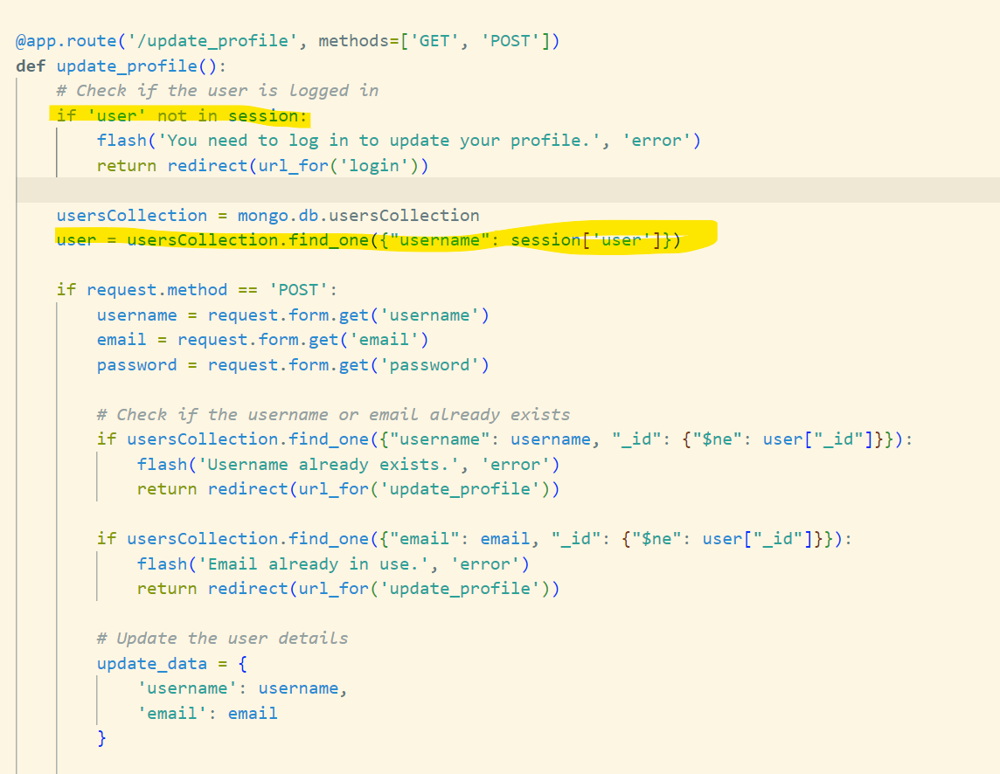
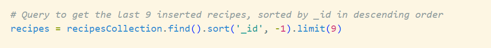

# Introduction to the Twisties Cookbook

Welcome to the **Twisties Cookbook**, a one-stop platform where culinary creativity meets convenience. Designed with food enthusiasts in mind, our web application allows you to easily find, share, and store your favorite recipes—all while discovering new ways to enhance your cooking experience.

## Purpose and Value for Users

The **Twisties Cookbook** is built for home cooks, foodies, and anyone passionate about preparing delicious meals. Our platform gives you the freedom to organize and access recipes like never before. Whether you’re searching for the perfect dish to cook tonight or want to add your own culinary creations to share with the world, the *Twisties Cookbook*  makes the process seamless.

With features like ingredient lists, step-by-step preparation instructions, personal favorite cuisine, and required tools, the application offers a comprehensive cooking experience that goes beyond simple recipes. Users can:

- **Find Recipes Easily**: Our intuitive search and directory allow you to locate recipes by ingredient, cuisine, or required cooking tools.
- **Add & Customize**: Upload your own recipes, edit them as needed, and share your unique culinary twists with the community.
- **Personal Cooking Library**: Store and manage your favorite recipes in one place, accessible from any device, any time.

## Purpose and Value for the Site Owner

In addition to being a valuable resource for users, the **Twisties Cookbook** serves as a platform to promote high-quality kitchen tools that can elevate any cooking experience. Each recipe highlights the necessary cooking tools, helping users discover the best products to enhance their culinary skills. By offering direct links and suggestions for kitchen tools, the app bridges the gap between cooking content and product discovery, ensuring a seamless integration of tools into the cooking process.

With **Twisties Cookbook**, cooking becomes more than just a task—it’s an interactive, engaging, and highly personalized experience. Start exploring, sharing, and cooking with a twist today!

# Table of Contents

1. [Requirements](#requirements)
2. [Usecase](#usecase)
3. [Design](#design)
4. [Development](#development)
5. [Testing](#testing)
6. [Deployment](#deployment)
7. [Credits](#credits)
8. [License](#license)

# REQUIREMENTS

## Functional Requirements

**User Login Verification**
   - The system must check if a user is logged in using session data.
   - If the user is not logged in, a welcome message for guests should be displayed.

**Personalized Welcome Message**
   - Display a welcome message that includes the username of the logged-in user.
   - Display a general welcome message for users who are not logged in.

**Dashboard Statistics (Nice to Have)**
   - Show statistics:
     - Total number of recipes available in the application.
     - Number of recipes added by the logged-in user.
     - Number of favorited recipes by the logged-in user.

**Quick Links Section**
   - Provide links for:
     - Home.
     - Viewing all recipes.
     - Contact.
     - Managing user recipes with CRUD Functionalities.
     - Updating user account information.

**Call to Action Button**
   - Include a prominent button that allows guests to log in to explore recipes.

**Featured Recipes Display**
   - Display a section for "Featured Recipes."

**Responsive Design**
   - Ensure that the design is adaptable across diffrent types of devices.

**Feedback Notifications**
   - Implement messages to provide feedback for various user actions.

## Non-Functional Requirements

**User Interface Design**
   - The interface should be intuitive and easy to navigate.
   - Use consistent design elements (colors, fonts) throughout the page.

**Accessibility**
   - The page must comply with WCAG 2.1 Level AA accessibility standards.

**Session Management**
   - Ensure that session data is securely managed and sensitive information is protected.

**Input Validation**
   - Validate all user inputs.

**Cross-Browser Support**
   - The website should be compatible with the latest versions of major browsers.

## Requirements Engineering
**Base Template**
   - Include CSS Frameworks
   - Include javaScript Libraries/files
   - Include header setion Brand logo linking to the home page.
   - Include a links that changes based on the user's login status.
   - Include a mobile-friendly sidebar menu.
   - Include a Main content section
   - Include a Footer Section.
   - **All pages should extend from the base template.**

**Index Page**
   - If a user is logged in, the page displays a personalized welcome message: "Welcome, {username}!".
   - **Nice to Have**Below the welcome message, there should be a dashboard summary showing:
   - **Total Recipes**: Displays the total number of recipes in the database.
   - **Recipes Added by User**: Displays the count of recipes added by the logged-in user.
   - **Favorited Recipes**: Displays the count of recipes favorited by the user.
   - Additional cards allow users to:
   - **Manage My Recipes**: Link to the recipe management page.
   - **View All Recipes**: Link to view all available recipes.
   - **Update Account**: Link to the account update page.
   - **Index Page for Guests**
      - If a user is not logged in, the page displays a welcoming message: "Welcome to **Twisties Cookbook**".
      - There should be a call-to-action button prompting guests to log in: "Log In to Explore Recipes".
   - **Section Header**: A heading titled "Featured Recipes" should be displayed in the center.
   - **Recipe Cards**: Each featured recipe should be shown in a card format, which includes:
   - An image of the recipe.
   - The title of the recipe.
   - The cooking time and serving information.
   - A link to view the full recipe.

**Contact Page**
   - There should be a button with a back arrow icon allowing users to navigate back to the previous page.
   - There should be a centered header with the text "Contact Us" to indicate the purpose of the page.
   - There should be a form that captures user input with the following fields:
   - **Name**: A required text input for the user's name.
   - **Email**: A required email input for the user's email address.
   - **Message**: A required textarea for the user's message.
   - A submit button with that triggers the form submission.
   - A section displaying contact information.
   - A section with a centered header "Find Us" indicating the location of **Twisties Cookbook** Physical office.
   - An embedded Google Map that displays the location of the business.

**Log in Page**
   - Include a message prompting users who do not have an account to register, linking to the registration page
   - Include the following fields in the login form:
      - **Email Field:**
      - **Password Field:**
      - **Submit Button**

**Registration Page**
   - Include a message prompting users who already have an account to log in, linking to the login page:
   - Include a Registration Form with the following fields: 
      - **Name Field:**
      - **Email Field:**
      - **Password Field:**
      - **Register Button**

**Recipes Page**
   - Include a button to allow users to go back to the previous page
   - Display the title of the page
   - Implement a search form for users to search recipes
   - Create a section to display the recipes
   - Implement pagination controls to navigate through multiple pages of recipes
   - Users should be able to add recipes to favorites
   - users should be able to share recipes to their page on social media
   - **NICE TO HAVE** Build upon the required tools field to promote Twisties brand of kitchen tools 
   

**Manage Recipe**
   - Users Should be able to perform CRUD functionalities on recipes. Update/Delete only for the recipes they added.

**Cart**
- The users cart page should extend the base template
- Display the title of the page
- Check if the cart is empty and display a message accordingly
- Create a list to display items in the cart
- Display a summary of the cart contents and total cost
- Confirm before deleting an item in cart
- Users should be able to edit items in their cart

[Back to Top](#requirements)

# USECASE

### Actors
- **Primary Actor:** User
- **Secondary Actors:** System
### Main Flow (Basic Scenario)

**Access Home Page**
   - **Step 1:** The user navigates to the home page http://twisties-cook-book-e57860eccdee.herokuapp.com/.
      - The system queries the `recipesCollection` to retrieve the last 9 inserted recipes, sorted by `_id` in descending order.
      - The system calculates the total number of recipes in the database.
      - if the user is logged in (determined by checking the session):
         - The system queries the `usersCollection` to find the user by their username.
         - The system counts the number of recipes added by the logged-in user.
         - The system retrieves the count of recipes that the user has favorited.
         - The system renders the `index.html` template, passing the following data:
            - The latest 9 recipes.
            - The total number of recipes in the database.
            - The count of recipes added by the logged-in user.
            - The count of favorited recipes by the logged-in user.
      - if the user isnt logged in
         - The system will render the guest home page and prompt them to login.

**Access Recipe**
   - **Step 2:** The user navigates to the recipes page or the user clicks on the total recipe card or view all recipe Card.
      - The system checks if the user is logged in.
         - The system counts the total number of recipes for pagination purposes.
         - The system retrieves a subset of recipes based on the current page and the number of recipes per page (6 recipes per page).
         - The system renders the `recipes.html` template, passing the list of recipes, current page.
      -  if the user searches with the provided search field
         -  The system queries the `recipesCollection` using the search term, if provided. If no search term is entered, the query matches all recipes.
         -  The system calculates the total number of matching recipes to support pagination and determines the total number of pages based on the `per_page` value (6 recipes per page).
         -  The system retrieves the recipes for the current page and renders the `recipes.html` template, passing the recipes, current page number, total pages, and search term to the template for display.
      - if the user isnt loggedin
         - The system redirects the user to the `login.html` template page.

**Access Recipe Details**
   - **Step 3:** The user clicks on a particular recipe.
      - The system checks if the user is logged in by verifying the session.
         - The system attempts to convert the `recipe_id` to an `ObjectId`.
         - The system queries the `recipesCollection` to find the recipe by its ID.
         - The system checks if the recipe is in the user's list of favorited recipes.
         - The system sets `is_favorite` to `True` if the recipe is favorited; otherwise, it remains `False`.
         - The system renders the `recipe_detail.html` template, passing the recipe details, `is_favorite` status, and `from_page` parameters.
            - if the user clicks any of the tags
               -  The system receives the `<tag>` parameter from the URL.
               -  The system queries the `recipesCollection` in the database, searching for recipes that contain the specified `<tag>` in their `tags` field.
               -  The system renders the `recipes_by_tag.html` template, passing the list of matching recipes and the tag to the template.
            -if the user clicks on the Discover more tools here link in the required tools section.
               -  The system receives the request to view equipment categories.
               -  The system queries the `equipmentCollection` in the MongoDB database, retrieving all documents with the fields `category` (name of the category) and `menu_image` (image associated with the category).
               - The system renders the `equipment_categories.html` template, passing the list of categories to be displayed to the user.
               - if the user clicks any of the categories
                  -  The system queries the MongoDB collection `equipmentCollection` to retrieve the category based on the provided `category_id`.
                  -  The system attempts to convert the `category_id` to an `ObjectId`. If it fails (invalid `ObjectId`), the system treats `category_id` as a string.
                  -  The system retrieves the category matching the `category_id`.
                  -  The system retrieves the list of items in the category from the `items` field.
                  -  The system renders the `category_items.html` template, passing the category and its items to the template.

**Access Manage Recipes**
   - **Step 4:** The user clicks on the manage recipe card.
   - The system checks if the user is logged in.
      - The system queries the `recipesCollection` in MongoDB to retrieve recipes that were added by the logged-in user.
      - The system renders the `manage_recipes.html` template and passes the user's recipes for display, allowing the user to manage their recipe collection.
   - If the user tries to access manage recipe without being logged in, they are redirected to the login page.
   - **Step 5:** The user clicks on the manage view recipe.
      - The system checks if the user is logged in by verifying the session.
         - The system attempts to convert the `recipe_id` to an `ObjectId`.
         - The system queries the `recipesCollection` to find the recipe by its ID.
         - The system checks if the recipe is in the user's list of favorited recipes.
         - The system sets `is_favorite` to `True` if the recipe is favorited; otherwise, it remains `False`.
         - The system renders the `recipe_detail.html` template, passing the recipe details, `is_favorite` status, and `from_page` parameters.
      - If the user tries to access view recipe without being logged in, they are redirected to the login page.
   - **Step 6:** The user clicks on the edit recipe.
      -The system checks if the user is logged in.
         - The system fetches the recipe with the given `recipe_id` from the MongoDB collection.
      - If the user tries to access edit recipe without being logged in, they are redirected to the login page.
   - **Step 7:** The user edits the recipe details on the form and submits the updated information via a `POST` request.
      - The system collects the updated data from the form.
      - The system updates the recipe document in the `recipesCollection` in MongoDB with the new data.
      - The user is redirected to the "Manage Recipes" page.
   - **Step 8** The user clicks on delete recipe
      - The system converts the `recipe_id` to an `ObjectId` and attempts to delete the recipe from the `recipesCollection` in the MongoDB database.
      - The user is redirected back to the "Manage Recipes" page to view the updated list of their recipes.

**Access Recipes Added By Me**
   - **Step 9** The user clicks on recipe added by me card
      - The system checks if the user is logged in.
      - The system queries the `recipesCollection` in MongoDB to retrieve recipes that were added by the logged-in user.
      - The system renders the `manage_recipes.html` template and passes the user's recipes for display, allowing the user to manage their recipe collection.
   
**Access Favorites**
   -  **Step 10** The user clicks on the my favorites card.
      -  The system checks if the user is logged in by verifying the session.
      -  If the user is logged in, the system queries the `usersCollection` to retrieve the logged-in user's document.
      -  The system extracts the list of favorited recipe IDs from the user’s document.
      -  If the user has favorited recipes, the system queries the `recipesCollection` using the list of favorite recipe IDs to retrieve the corresponding recipe documents.
      -  The system renders the `favorites.html` template, passing the list of favorite recipes to be displayed on the page.

**Update User Profile**
   - **Step 11** The user clicks on the update account card.
      -  The system checks if the user is logged in by verifying the session.
      -  The system queries the `usersCollection` to get the current user’s document using their session username.
      -  The system displays the current user profile data in the `update_profile.html` form.
      -  The user updates their username, email, or password in the form and submits it.
      -  The system checks if the provided username or email already exists in the database for another user.
      -  If there are no conflicts, the system updates the user's document in `usersCollection` with the new username, email, and (if provided) the hashed password.
      -  If the username has been changed, the system updates the session with the new username.
      -  The user is redirected to the index page where they can continue using the application with their updated profile.

[Back to Top](#requirements)

# DESIGN

### Low-Fidelity Prototype

This is the foundational blueprint for Twisties' Cook Book Design and layout. It outlines the structural framework of the site, depicting the arrangement of key elements such as navigation menus, content sections, and interactive features.

### Color Justification

**Color Meanings and Associations**
- The choice of a Teal, white, and dark-grey colour scheme for the **Twisties Cookbook** is deliberate and serves several purposes:

   -  Teal is often associated with freshness, balance, and tranquility, making it a suitable choice for a cookbook focused on healthy or innovative recipes. It evokes the colors of fresh herbs and vegetables, aligning well with a culinary theme. This shade can also represent creativity and innovation, suggesting that the cookbook offers fresh ideas and twists on traditional recipes.

   -  White symbolizes purity, simplicity, and cleanliness. Using white as a background color helps create a clean, uncluttered look that makes recipes and ingredients stand out, enhancing readability. Also, white space can provide a sense of openness and calm, allowing users to navigate the cookbook easily without feeling overwhelmed by too many elements or colors.

   - Dark Grey conveys stability and sophistication, grounding the color palette. It provides a strong contrast against the teal and white, ensuring that text is easy to read and elements are distinct.

   - The combination of teal, white, and dark grey creates a visually appealing contrast that enhances readability. 

[Back to Top](#requirements)

# DEVELOPMENT

Initially the requirements for this project was vague and it had to be updated as the process unfolded, and I was working as a solo developer, as a result the Software Development Life Cycle (SDLC) approach selected for this project was Agile, specifically an Iterative variant known as Lean Software Development (LSD). LDS is an adaptation of the Lean manufacturing principles, originally developed by Toyota, applied to the software development process. The goal of Lean Software Development is to deliver software quickly and efficiently by focusing on value creation and eliminating waste in the development process. It emphasizes continuous improvement, minimizing resource use, and maximizing customer value.

This development approach enabled me to use a flow-based approach, where the tasks for **Twisties Cookbook** were prioritized and completed one by one. This allowed me to manage the development workload effectively.

### Implementation

The **Twisties Cookbook** was developed using a combination of Flask, JavaScript, Materialize CSS, CSS, Jinja templating, and MongoDB to create a dynamic and interactive platform for users to manage and explore various recipes. The implementation process was carefully planned to ensure that the application was both functional and visually appealing while maintaining a seamless user experience.

#### **Data Handling and Database Integration**
**Twisties Cookbook** utilized MongoDB as the primary database to store data such as recipe information, user data, and equipment categories. It is a popular NoSQL (Non-Relational) database that stores data in a flexible, document-oriented format known as BSON (Binary JSON), which is similar to JSON. Unlike traditional Relational Database Management Systems (RDBMS), MongoDB does not use structured tables and rows. Instead, it organizes data as collections of documents, making it highly scalable, adaptable, and capable of handling large volumes of unstructured or semi-structured data.

MongoDB was selected because **Twisties Cookbook** has an evolving data requirements and MongoDB supports dynamic, schema-less design, allowing documents to have varying structures. Also, It is designed for scale-out architectures that handle large data volumes and high traffic like the type that will be generated from **Twisties Cookbook**. Hence, it was considered fit for use and purpose. 

The data collections created were used to categorize and manage data efficiently. Flask-PyMongo, a Flask extension, was employed to establish a connection between the Flask app and the MongoDB database, allowing for seamless data retrieval and updates. Here are the collections that were created in MongoDB:

-**userCollection** 
   - Used for storing user information in the MongoDB collection.
   - Fields Explanation:
   ---------------------------------------------
               - _id
               - Type: ObjectId
               - Description: This is a unique identifier for the user document in the MongoDB collection. MongoDB automatically generates this value when a new document is inserted which ensures that a specific user document can be uniquely identified within the collection.
         
               - username
               - Type: String
               - Description: This field stores the unique username chosen by the user when they registered.  The application will use this field for displaying the user's name in various parts of the application, such as on the profile page.
           
               - email
               - Type: String
               - Description: This field contains the user's email address, which they use to register, log in to the application and for communication purposes.

               - password_hash
               - Type: String
               - Description: This field stores the hashed version of the user's password. Hashing will ensure that the password is stored securely and is not readable in plain text. This hash will be used for verifying the password during the login process.

               - role
               - Type: String
               - Description: This field specifies the role of the user in the application. The role can be User, Admin, or other predefined roles based on the application's access control requirements.

               - favorited_recipes
               - Type: Array of ObjectIds
               - Description: This field is an array that stores the unique IDs of recipes that the user has marked as favorites. The IDs correspond to recipes stored in the recipesCollection. The application will use this field to check if a particular recipe is in the user’s favorites list and to display all favorited recipes on the user's profile or favorites page.

**recipesCollection**
   - Used for storing recipe information in the MongoDB collection.
   - Fields Explanation:
   ---------------------------------------------
               -  _id
               -  Type: ObjectId
               -  Description: This is a unique identifier automatically generated by MongoDB when a new user document is inserted. It ensures that each user can be uniquely identified within the collection.

               -  title
               -  Type: String
               -  Description: The name or title of the recipe. This field is used to display the name of the dish in listings, search results, and on the recipe detail page.

               -  ingredients
               -  Type: Array of String elements
               -  Description: A list of ingredients required for the recipe. Each element in the array represents a separate ingredient, making it easier to parse and display the list in a structured manner.

               -  preparation_steps
               -  Type: Array of String elements
               -  Description: Step-by-step instructions on how to prepare the dish. Each element in the array corresponds to a separate step, making it easy to present the preparation process in a logical order.

               -  required_tools
               -  Type: Array of String elements
               -  Description: A list of kitchen tools needed to prepare the recipe. This will help the user ensure they have all the necessary equipment before starting to cook.

               -  cuisine
               -  Type: String
               -  Description: The type of cuisine the recipe belongs to, providing additional context about the dish's origin.
            
               -  prep_time
               -  Type: Integer
               -  Description: The amount of time (in minutes) required to prepare the ingredients before cooking.

               -  cook_time
               -  Type: Integer
               -  Description: The amount of time (in minutes) required to cook the dish.
            
               - servings
               -  Type: String
               -  Description: The number of servings the recipe yields, allowing users to adjust portions as needed.

               -  image_url
               -  Type: String (URL)
               -  Description: A URL pointing to an image of the prepared dish. This image will be used to visual representation on recipe listings and detail pages.
            
               -  tags
               -  Type: Array of String elements
               -  Description: A list of tags associated with the recipe, used for categorization, filtering, and searching. 
            
               -  added_by
               -  Type: String
               -  Description: The username of the person who added the recipe to the collection. This will help track the contributor and potentially offer editing privileges to the original creator.

               -  date_time_added
               -  Type: ISODate
               -  Description: The date and time when the recipe was added to the collection, stored in ISO format. This field will be used to sort or filter recipes by recency.
            
               -  date_time_edited
               -  Type: ISODate
               -  Description: The date and time when the recipe was last edited, if applicable. This field will be set to null if no edits have been made since the recipe was first added.       

**equipmentCollection**
   - Used for storing cooking tools/equiptments information in the MongoDB collection.
   - Fields Explanation:
   --------------------------------------------
               -  _id
               -  Type: ObjectId
               -  Description: A unique identifier for the equipment category, automatically generated by MongoDB. It allows for distinct identification of each document within the collection.

               -  category
               -  Type: String
               -  Description: The name of the equipment category, which helps classify and organize the kitchen tools within the collection. This will be used for filtering and searching equipment by their usage or type.

               -  items
               -  Type: Array of Object elements
               -  Description: A list of individual equipment items within the category. Each item object contains detailed information such as name, image URL, stock, price, and description.
                  -  Nested Object Fields:
                     -  name
                        -  Type: String
                        -  Description: The name of the equipment item.
                     
                     -  image_url
                        -  Type: String (URL)
                        -  Description: A URL pointing to an image of the equipment item, which can be displayed on the equipment detail page or listings.
                     
                     -  No_in_Stock
                        -  Type: Integer
                        -  Description: The number of units available in stock for the item, useful for managing inventory.
                   
                     -  price_in_pounds
                        -  Type: Integer
                        -  Description: The price of the item in pounds (£).
                     
                     -  description
                        -  Type: String
                        -  Description: A brief description of the item, explaining its purpose and usage.
                     
             -  menu_image
               -  Type: String (URL)
               -  Description: A URL pointing to an icon image representing the category. This image will be used in the menu or category listings for visual identification.

**cartsCollection**
   - Used for storing items that has been added to the users cart in the MongoDB collection.
   - Fields Explanation:
   ----------------------------------------------
               - _id
               -  Type: ObjectId
               -  Description: A unique identifier for this cartItem, automatically generated by MongoDB. It allows for distinct identification of each cart item within the collection.
            
            -  item_category_id
               -  Type: ObjectId
               -  Description: The ID of the category to which the item belongs. This references a document in the equipmentCollection to link the item to its category.

            -  item_name
               -  Type: String
               -  Description: The name of the cart item, which is part of the equipment catalog.

            -  item_price
               -  Type: String
               -  Description: The price of a single unit of the cart item in pounds (£).

            -  quantity
               -  Type: Integer
               -  Description: The number of units of the item in cart.

            -  total_price
               -  Type: Integer
               -  Description: The total price for the cart item, will be calculated by multiplying item_price by quantity.

            -  user
               -  Type: ObjectId
               -  Description: The ID of the user who made the purchase, linking this document to the user profile stored in the usersCollection.

**contactMessages**
   - Used for storing messages from the contact page for the administrators view in the MongoDB collection.
   - Fields Explanation:
   ----------------------------------------------
           -    _id
               -  Type: ObjectId
               -  Description: A unique identifier for this contact form submission, automatically generated by MongoDB. It allows for distinct identification of each message within the collection.

            -  name
               -  Type: String
               -  Description: The name of the user who submitted the contact form.

            -  email
               -  Type: String
               -  Description: The email address provided by the user for correspondence or follow-up communication.

            -  message
               -  Type: String
               -  Description: The message or inquiry sent by the user through the contact form. It could be a general inquiry, feedback, or a request for support.

[Back to Top](#requirements)

#### **Backend Development with Flask**

Flask, a lightweight and flexible Python web framework, was the backbone of the **Twisties Cookbook** due to its simplicity and ease of integration with other technologies. The backend implementation involved the following key elements:

- **Routing and Views**: Flask’s routing system was used to define endpoints for displaying pages, handling form submissions, and performing CRUD (Create, Read, Update, Delete) operations on recipe data. Each page, such as the homepage, recipe detail page, and user profile, was implemented using separate view functions.

### **Modules used in the backend code**

**Flask**: Flask is a lightweight and modular web framework for Python, used for building web applications. It provides essential tools and features such as routing, template rendering, and request handling. Flask was used to create the app instance and manage the flow of the application using routes and view functions. 

**flash**:This function is part of Flask and is used to send one-time messages from the backend to the frontend (usually in response to a user action). Messages flashed using flash() are stored in the session and displayed on the next page load, then removed.

**render_template**: Renders a HTML template file and returns it as a response to the client. It also allowed passing variables to the template for dynamic content generation. It was used to render pages like index.html, login.html, recipe_details.html etc., and inject data from the backend into these templates.

**redirect**: Was used to redirect users to a different endpoint/ URL after a certain action. For example, redirecting a user to the login page after logging out. It simplified the process of sending users to different pages programmatically.

**request**: Provided access to incoming request data, such as form submissions, query parameters, and headers. This module allows the server to handle HTTP methods like GET, POST, and more. Request was used to handle data submitted through forms.

**session**: A dictionary-like object provided by Flask to store information specific to a user's session, such as login status. The session data is stored on the server and can persist across multiple requests. Session was used to keep track of logged-in users and their session-specific data like username or cart_item_count.

**url_for**: Generates URLs for Flask routes based on the endpoint name. This is particularly useful for creating dynamic links that will update if the route changes. Instead of hardcoding URLs, url_for helps maintain link consistency across the application.

**jsonify**: Converts Python dictionaries or lists into JSON (JavaScript Object Notation) format. It is used for building RESTful APIs and returning structured data responses. jsonify was used for AJAX responses to send data to the frontend.

**flask_pymongo.PyMongo**: is a library that facilitates the connection between a Flask application and a MongoDB database. It simplifies CRUD (Create, Read, Update, Delete) operations and provides methods to interact with the MongoDB collections. PyMongo was used to connect to the MongoDB database and perform operations like inserting new user data, retrieving recipes, or updating cart information.

**Bson (Binary JSON) and Related Libraries**
**bson.objectid.ObjectId**: Part of the BSON (Binary JSON) library, ObjectId is a class used to create or handle MongoDB’s unique identifier type, ObjectId. This was used for querying and handling MongoDB documents by their _id fields, ensuring operations are performed on the correct data entries.

**bson.errors.InvalidId**: An exception class from the BSON library, InvalidId is raised when attempting to convert a string into an ObjectId fails.
This helps in validating and handling scenarios where the provided ID is not a valid MongoDB identifier.

**Werkzeug Security**
**werkzeug.security.generate_password_hash**: A utility function that hashes a plaintext password using a secure hashing algorithm (e.g., SHA256) and a salt value. This function is used during user registration to securely store passwords in the database.

**werkzeug.security.check_password_hash**: Compares a plaintext password to its hashed counterpart stored in the database to validate login credentials.
This was used when a user attempts to log in, ensuring that the password entered matches the stored hash value.

**DateTime Libraries**
**datetime and timedelta**: Part of Python’s standard library, datetime provides classes for manipulating dates and times. datetime and timedelta was used for features like tracking time of recipe creation and edit.

**Cloudinary**
**cloudinary.uploader**: Cloudinary is a cloud-based media management service. The cloudinary.uploader module provides methods to upload images or other media files to Cloudinary’s cloud storage. This was useful in Twisties cook book for handling user profile pictures, recipe images, or other media content that needs to be hosted and served dynamically.

[Back to Top](#requirements)

#### **Features and Functionalities Implemented**
This section contains a description of the features and functions implemented. The structure of the pages in **Twisties Cook Book** used Flask's templating system (Jinja2). All pages inherit their layout from base.html, that includes includes the common structure (header, footer, and Nav) for all pages. For styling the Materialize framework was used along with some custom CSS. 

**Registration**

This form allows the user to submit their information (username, email, and password). The form action points to the /register route (handled by Flask), and the POST method ensures the form data is securely submitted to the server.

-  When the user initially loads the registration page, the request method is GET, and the form is displayed via return render_template('register.html').
-  When the user submits the registration form, the request method becomes POST, and the form data is processed.
-  The data from the registration form is extracted using request.form.get('...'). The values are retrieved from the form.
-  A hashing function (generate_password_hash) is used to hash the password before storing it in the database.
-  A dictionary is created to represent the new user
-  role is hardcoded as 'User'.
-  mongo.db.usersCollection.insert_one(user_data) inserts the user_data dictionary into the usersCollection in MongoDB database.
-  Upon successful registration, the user is flashed a success message and redirected to the login page.

**Login Function**

The form allows users to input their login details, such as email and password, and submit them to the server using a POST request. The form action is directed at the /login route in Flask.

-  When the user first visits the login page, the method is GET, and the login form is rendered (return render_template('login.html')).
-  When the user submits the form, the method changes to POST, and the server processes the login credentials.
-  The user's email and password are extracted from the form
-  The email provided is used to search for the user in the MongoDB collection usersCollection. If a matching user is found, the server proceeds to verify the password.
-  The check_password_hash function compares the hashed password stored in the database (user['password_hash']) with the password entered by the user. If the password is correct, the user is logged in.
-  Upon successful login, the user's session is set with their username. Flask's session management keeps track of the logged-in user's information. The session.permanent = True line ensures the session lasts longer (as defined by your app's settings).
-  If the login is successful, a success message is flashed
-  If the password is incorrect or the email is not found in the database, an error message is flashed
-  fter logging in, the user is redirected to the index page

**Access Index Page**

**Manage Recipes**
   -  Add Recipe
   -  Edit Recipe
   -  Delete Reciepe
   -  View all recipes
   -  Search
   -  Search By Tag
   -  View recipe by ID
   -  Add to Favorite
   -  Click Tag to Search
   -  Required tools
   -  Equiptment Category
   -  Category Items
   -  Add to cart
   -  Edit Cart Items
   -  Delete Cart Item

