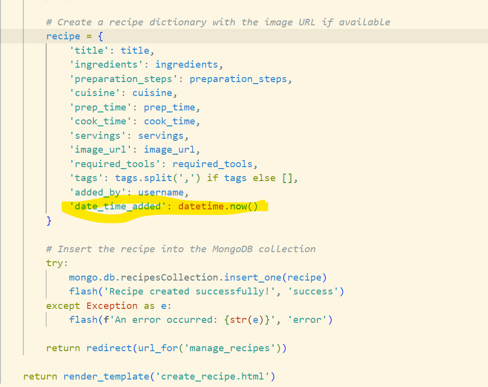
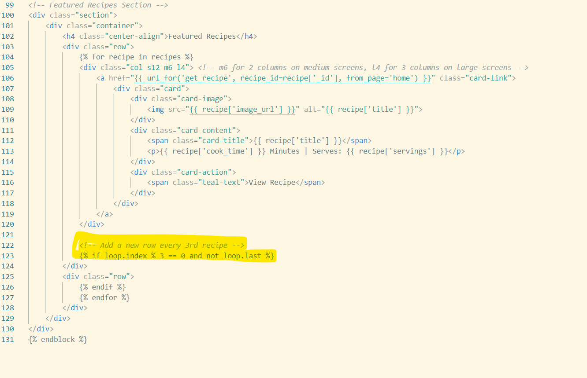
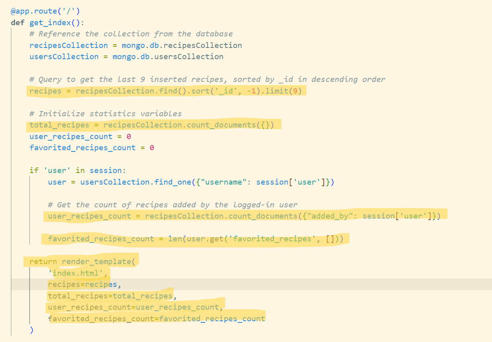
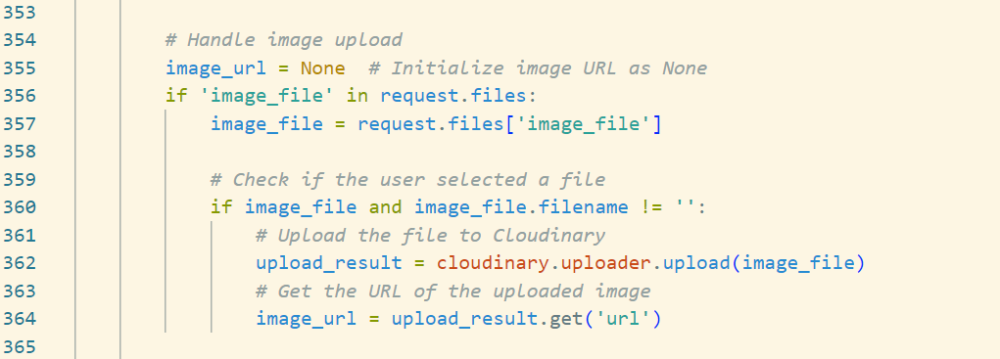
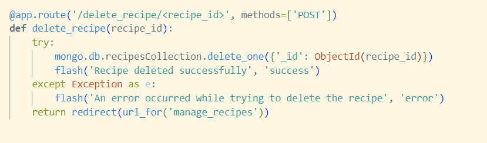
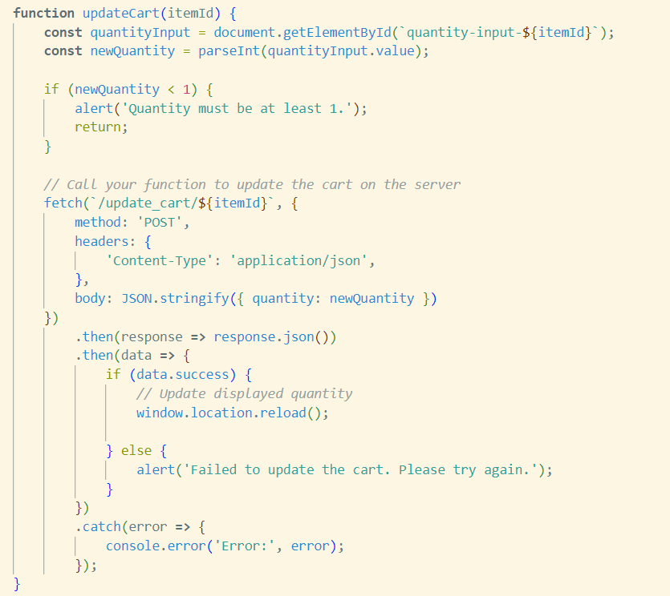

# Introduction to the Twisties Cookbook

Welcome to the **Twisties Cookbook**, a one-stop platform where culinary creativity meets convenience. Designed with food enthusiasts in mind, our web application allows you to easily find, share, and store your favorite recipes—all while discovering new ways to enhance your cooking experience.

## Purpose and Value for Users

The **Twisties Cookbook** is built for home cooks, foodies, and anyone passionate about preparing delicious meals. Our platform gives you the freedom to organize and access recipes like never before. Whether you’re searching for the perfect dish to cook tonight or want to add your own culinary creations to share with the world, the *Twisties Cookbook*  makes the process seamless.

With features like ingredient lists, step-by-step preparation instructions, personal favorite cuisine, and required tools, the application offers a comprehensive cooking experience that goes beyond simple recipes. Users can:

- **Find Recipes Easily**: Our intuitive search and directory allow you to locate recipes by ingredient, cuisine, or required cooking tools.
- **Add & Customize**: Upload your own recipes, edit them as needed, and share your unique culinary twists.
- **Personal Cooking Library**: Store and manage your favorite recipes in one place, accessible from any device, any time.

## Purpose and Value for the Site Owner

In addition to being a valuable resource for users, the **Twisties Cookbook** serves as a platform to promote high-quality kitchen tools that can elevate any cooking experience. Each recipe highlights the necessary cooking tools, helping users discover the best products to enhance their culinary skills. By offering direct links and suggestions for kitchen tools, the app bridges the gap between cooking content and product discovery, ensuring a seamless integration of tools into the cooking process.

With **Twisties Cookbook**, cooking becomes more than just a task—it’s an interactive, engaging, and highly personalized experience. Start exploring, sharing, and cooking with a twist today!

# Table of Contents

1. [Requirements](#requirements)
2. [Usecase](#usecase)
3. [Design](#design)
4. [Development](#development)
5. [Testing](#testing)
6. [Deployment](#deployment)
7. [Credits](#credits)
8. [License](#license)

# REQUIREMENTS

## Functional Requirements

**User Login Verification**
   - The system must check if a user is logged in using session data.
   - If the user is not logged in, a welcome message for guests should be displayed.

**Personalized Welcome Message**
   - Display a welcome message that includes the username of the logged-in user.
   - Display a general welcome message for users who are not logged in.

**Dashboard Statistics (Nice to Have)**
   - Show statistics:
     - Total number of recipes available in the application.
     - Number of recipes added by the logged-in user.
     - Number of favorited recipes by the logged-in user.

**Quick Links Section**
   - Provide links for:
     - Home.
     - Viewing all recipes.
     - Contact.
     - Managing user recipes with CRUD Functionalities.
     - Updating user account information.

**Call to Action Button**
   - Include a prominent button that allows guests to log in to explore recipes.

**Featured Recipes Display**
   - Display a section for "Featured Recipes."

**Responsive Design**
   - Ensure that the design is adaptable across diffrent types of devices.

**Feedback Notifications**
   - Implement messages to provide feedback for various user actions.

## Non-Functional Requirements

**User Interface Design**
   - The interface should be intuitive and easy to navigate.
   - Use consistent design elements (colors, fonts) throughout the page.

**Accessibility**
   - The page must comply with WCAG 2.1 Level AA accessibility standards.

**Session Management**
   - Ensure that session data is securely managed and sensitive information is protected.

**Input Validation**
   - Validate all user inputs.

**Cross-Browser Support**
   - The website should be compatible with the latest versions of major browsers.

## Requirements Analysis
**Base Template**
   - Include CSS Frameworks
   - Include javaScript Libraries/files
   - Include header setion Brand logo linking to the home page.
   - Include a links that changes based on the user's login status.
   - Include a mobile-friendly sidebar menu.
   - Include a Main content section
   - Include a Footer Section.
   - **All pages should extend from the base template.**

**Index Page**
   - If a user is logged in, the page displays a personalized welcome message: "Welcome, {username}!".
   - **Nice to Have**Below the welcome message, there should be a dashboard summary showing:
   - **Total Recipes**: Displays the total number of recipes in the database.
   - **Recipes Added by User**: Displays the count of recipes added by the logged-in user.
   - **Favorited Recipes**: Displays the count of recipes favorited by the user.
   - Additional cards allow users to:
   - **Manage My Recipes**: Link to the recipe management page.
   - **View All Recipes**: Link to view all available recipes.
   - **Update Account**: Link to the account update page.
   - **Index Page for Guests**
      - If a user is not logged in, the page displays a welcoming message: "Welcome to **Twisties Cookbook**".
      - There should be a call-to-action button prompting guests to log in: "Log In to Explore Recipes".
   - **Section Header**: A heading titled "Featured Recipes" should be displayed in the center.
   - **Recipe Cards**: Each featured recipe should be shown in a card format, which includes:
   - An image of the recipe.
   - The title of the recipe.
   - The cooking time and serving information.
   - A link to view the full recipe.

**Contact Page**
   - There should be a button with a back arrow icon allowing users to navigate back to the previous page.
   - There should be a centered header with the text "Contact Us" to indicate the purpose of the page.
   - There should be a form that captures user input with the following fields:
   - **Name**: A required text input for the user's name.
   - **Email**: A required email input for the user's email address.
   - **Message**: A required textarea for the user's message.
   - A submit button with that triggers the form submission.
   - A section displaying contact information.
   - A section with a centered header "Find Us" indicating the location of **Twisties Cookbook** Physical office.
   - An embedded Google Map that displays the location of the business.

**Log in Page**
   - Include a message prompting users who do not have an account to register, linking to the registration page
   - Include the following fields in the login form:
      - **Email Field:**
      - **Password Field:**
      - **Submit Button**

**Registration Page**
   - Include a message prompting users who already have an account to log in, linking to the login page:
   - Include a Registration Form with the following fields: 
      - **Name Field:**
      - **Email Field:**
      - **Password Field:**
      - **Register Button**

**Recipes Page**
   - Include a button to allow users to go back to the previous page
   - Display the title of the page
   - Implement a search form for users to search recipes
   - Create a section to display the recipes
   - Implement pagination controls to navigate through multiple pages of recipes
   - Users should be able to add recipes to favorites
   - users should be able to share recipes to their page on social media
   - **NICE TO HAVE** Build upon the required tools field to promote Twisties brand of kitchen tools 
   

**Manage Recipe**
   - Users Should be able to perform CRUD functionalities on recipes. Update/Delete only for the recipes they added.

**Cart (Nice to have)**
- The users cart page should extend the base template
- Display the title of the page
- Check if the cart is empty and display a message accordingly
- Create a list to display items in the cart
- Display a summary of the cart contents and total cost
- Confirm before deleting an item in cart
- Users should be able to edit items in their cart

[BACK TO TOP](#REQUIREMENTS)

# USECASE

## Actors
- **Primary Actor:** User
- **Secondary Actors:** System
## Main Flow (Basic Scenario)

**Access Home Page**
   - **Step 1:** The user navigates to the home page http://twisties-cook-book-e57860eccdee.herokuapp.com/.
      - The system queries the `recipesCollection` to retrieve the last 9 inserted recipes, sorted by `_id` in descending order.
      - The system calculates the total number of recipes in the database.
      - if the user is logged in (determined by checking the session):
         - The system queries the `usersCollection` to find the user by their username.
         - The system counts the number of recipes added by the logged-in user.
         - The system retrieves the count of recipes that the user has favorited.
         - The system renders the `index.html` template, passing the following data:
            - The latest 9 recipes.
            - The total number of recipes in the database.
            - The count of recipes added by the logged-in user.
            - The count of favorited recipes by the logged-in user.
      - if the user isnt logged in
         - The system will render the guest home page and prompt them to login.

**Access Recipe**
   - **Step 2:** The user navigates to the recipes page or the user clicks on the total recipe card or view all recipe Card.
      - The system checks if the user is logged in.
         - The system counts the total number of recipes for pagination purposes.
         - The system retrieves a subset of recipes based on the current page and the number of recipes per page (6 recipes per page).
         - The system renders the `recipes.html` template, passing the list of recipes, current page.
      -  if the user searches with the provided search field
         -  The system queries the `recipesCollection` using the search term, if provided. If no search term is entered, the query matches all recipes.
         -  The system calculates the total number of matching recipes to support pagination and determines the total number of pages based on the `per_page` value (6 recipes per page).
         -  The system retrieves the recipes for the current page and renders the `recipes.html` template, passing the recipes, current page number, total pages, and search term to the template for display.
      - if the user isnt loggedin
         - The system redirects the user to the `login.html` template page.

**Access Recipe Details**
   - **Step 3:** The user clicks on a particular recipe.
      - The system checks if the user is logged in by verifying the session.
         - The system attempts to convert the `recipe_id` to an `ObjectId`.
         - The system queries the `recipesCollection` to find the recipe by its ID.
         - The system checks if the recipe is in the user's list of favorited recipes.
         - The system sets `is_favorite` to `True` if the recipe is favorited; otherwise, it remains `False`.
         - The system renders the `recipe_detail.html` template, passing the recipe details, `is_favorite` status, and `from_page` parameters.
            - if the user clicks any of the tags
               -  The system receives the `<tag>` parameter from the URL.
               -  The system queries the `recipesCollection` in the database, searching for recipes that contain the specified `<tag>` in their `tags` field.
               -  The system renders the `recipes_by_tag.html` template, passing the list of matching recipes and the tag to the template.
            -if the user clicks on the Discover more tools here link in the required tools section.
               -  The system receives the request to view equipment categories.
               -  The system queries the `equipmentCollection` in the MongoDB database, retrieving all documents with the fields `category` (name of the category) and `menu_image` (image associated with the category).
               - The system renders the `equipment_categories.html` template, passing the list of categories to be displayed to the user.
               - if the user clicks any of the categories
                  -  The system queries the MongoDB collection `equipmentCollection` to retrieve the category based on the provided `category_id`.
                  -  The system attempts to convert the `category_id` to an `ObjectId`. If it fails (invalid `ObjectId`), the system treats `category_id` as a string.
                  -  The system retrieves the category matching the `category_id`.
                  -  The system retrieves the list of items in the category from the `items` field.
                  -  The system renders the `category_items.html` template, passing the category and its items to the template.

**Access Manage Recipes**
   - **Step 4:** The user clicks on the manage recipe card.
   - The system checks if the user is logged in.
      - The system queries the `recipesCollection` in MongoDB to retrieve recipes that were added by the logged-in user.
      - The system renders the `manage_recipes.html` template and passes the user's recipes for display, allowing the user to manage their recipe collection.
   - If the user tries to access manage recipe without being logged in, they are redirected to the login page.
   - **Step 5:** The user clicks on the manage view recipe.
      - The system checks if the user is logged in by verifying the session.
         - The system attempts to convert the `recipe_id` to an `ObjectId`.
         - The system queries the `recipesCollection` to find the recipe by its ID.
         - The system checks if the recipe is in the user's list of favorited recipes.
         - The system sets `is_favorite` to `True` if the recipe is favorited; otherwise, it remains `False`.
         - The system renders the `recipe_detail.html` template, passing the recipe details, `is_favorite` status, and `from_page` parameters.
      - If the user tries to access view recipe without being logged in, they are redirected to the login page.
   - **Step 6:** The user clicks on the edit recipe.
      -The system checks if the user is logged in.
         - The system fetches the recipe with the given `recipe_id` from the MongoDB collection.
      - If the user tries to access edit recipe without being logged in, they are redirected to the login page.
   - **Step 7:** The user edits the recipe details on the form and submits the updated information via a `POST` request.
      - The system collects the updated data from the form.
      - The system updates the recipe document in the `recipesCollection` in MongoDB with the new data.
      - The user is redirected to the "Manage Recipes" page.
   - **Step 8** The user clicks on delete recipe
      - The system converts the `recipe_id` to an `ObjectId` and attempts to delete the recipe from the `recipesCollection` in the MongoDB database.
      - The user is redirected back to the "Manage Recipes" page to view the updated list of their recipes.

**Access Recipes Added By Me**
   - **Step 9** The user clicks on recipe added by me card
      - The system checks if the user is logged in.
      - The system queries the `recipesCollection` in MongoDB to retrieve recipes that were added by the logged-in user.
      - The system renders the `manage_recipes.html` template and passes the user's recipes for display, allowing the user to manage their recipe collection.
   
**Access Favorites**
   -  **Step 10** The user clicks on the my favorites card.
      -  The system checks if the user is logged in by verifying the session.
      -  If the user is logged in, the system queries the `usersCollection` to retrieve the logged-in user's document.
      -  The system extracts the list of favorited recipe IDs from the user’s document.
      -  If the user has favorited recipes, the system queries the `recipesCollection` using the list of favorite recipe IDs to retrieve the corresponding recipe documents.
      -  The system renders the `favorites.html` template, passing the list of favorite recipes to be displayed on the page.

**Update User Profile**
   - **Step 11** The user clicks on the update account card.
      -  The system checks if the user is logged in by verifying the session.
      -  The system queries the `usersCollection` to get the current user’s document using their session username.
      -  The system displays the current user profile data in the `update_profile.html` form.
      -  The user updates their username, email, or password in the form and submits it.
      -  The system checks if the provided username or email already exists in the database for another user.
      -  If there are no conflicts, the system updates the user's document in `usersCollection` with the new username, email, and (if provided) the hashed password.
      -  If the username has been changed, the system updates the session with the new username.
      -  The user is redirected to the index page where they can continue using the application with their updated profile.

[BACK TO TOP](#REQUIREMENTS)

# DESIGN

## Low-Fidelity Prototype

This is the foundational blueprint for Twisties' Cook Book Design and layout. It outlines the structural framework of the site, depicting the arrangement of key elements such as navigation menus, content sections, and interactive features.

## Color Justification

**Color Meanings and Associations**
- The choice of a Teal, white, and dark-grey colour scheme for the **Twisties Cookbook** is deliberate and serves several purposes:

   -  Teal is often associated with freshness, balance, and tranquility, making it a suitable choice for a cookbook focused on healthy or innovative recipes. It evokes the colors of fresh herbs and vegetables, aligning well with a culinary theme. This shade can also represent creativity and innovation, suggesting that the cookbook offers fresh ideas and twists on traditional recipes.

   -  White symbolizes purity, simplicity, and cleanliness. Using white as a background color helps create a clean, uncluttered look that makes recipes and ingredients stand out, enhancing readability. Also, white space can provide a sense of openness and calm, allowing users to navigate the cookbook easily without feeling overwhelmed by too many elements or colors.

   - Dark Grey conveys stability and sophistication, grounding the color palette. It provides a strong contrast against the teal and white, ensuring that text is easy to read and elements are distinct.

   - The combination of teal, white, and dark grey creates a visually appealing contrast that enhances readability. 

[BACK TO TOP](#REQUIREMENTS)

# DEVELOPMENT

Initially the requirements for this project was vague and it had to be updated as the process unfolded, and I was working as a solo developer, as a result the Software Development Life Cycle (SDLC) approach selected for this project was Agile, specifically an Iterative variant known as Lean Software Development (LSD). LDS is an adaptation of the Lean manufacturing principles, originally developed by Toyota, applied to the software development process. The goal of Lean Software Development is to deliver software quickly and efficiently by focusing on value creation and eliminating waste in the development process. It emphasizes continuous improvement, minimizing resource use, and maximizing customer value.

This development approach enabled me to use a flow-based approach, where the tasks for **Twisties Cookbook** were prioritized and completed one by one. This allowed me to manage the development workload effectively.

## Implementation

The **Twisties Cookbook** was developed using a combination of Flask, JavaScript, Materialize CSS, CSS, Jinja templating, and MongoDB to create a dynamic and interactive platform for users to manage and explore various recipes. The implementation process was carefully planned to ensure that the application was both functional and visually appealing while maintaining a seamless user experience.

### **Data Handling and Database Integration**

**Twisties Cookbook** utilized MongoDB as the primary database to store data such as recipe information, user data, and equipment categories. It is a popular NoSQL (Non-Relational) database that stores data in a flexible, document-oriented format known as BSON (Binary JSON), which is similar to JSON. Unlike traditional Relational Database Management Systems (RDBMS), MongoDB does not use structured tables and rows. Instead, it organizes data as collections of documents, making it highly scalable, adaptable, and capable of handling large volumes of unstructured or semi-structured data.

MongoDB was selected because **Twisties Cookbook** has an evolving data requirements and MongoDB supports dynamic, schema-less design, allowing documents to have varying structures. Also, It is designed for scale-out architectures that handle large data volumes and high traffic like the type that will be generated from **Twisties Cookbook**. Hence, it was considered fit for use and purpose. 

The data collections created were used to categorize and manage data efficiently. Flask-PyMongo, a Flask extension, was employed to establish a connection between the Flask app and the MongoDB database, allowing for seamless data retrieval and updates. Here are the collections that were created in MongoDB:

-**userCollection** 
   - Used for storing user information in the MongoDB collection.
   - Fields Explanation:
   ---------------------------------------------
               - _id
               - Type: ObjectId
               - Description: This is a unique identifier for the user document in the MongoDB collection. MongoDB automatically generates this value when a new document is inserted which ensures that a specific user document can be uniquely identified within the collection.
         
               - username
               - Type: String
               - Description: This field stores the unique username chosen by the user when they registered.  The application will use this field for displaying the user's name in various parts of the application, such as on the profile page.
           
               - email
               - Type: String
               - Description: This field contains the user's email address, which they use to register, log in to the application and for communication purposes.

               - password_hash
               - Type: String
               - Description: This field stores the hashed version of the user's password. Hashing will ensure that the password is stored securely and is not readable in plain text. This hash will be used for verifying the password during the login process.

               - role
               - Type: String
               - Description: This field specifies the role of the user in the application. The role can be User, Admin, or other predefined roles based on the application's access control requirements.

               - favorited_recipes
               - Type: Array of ObjectIds
               - Description: This field is an array that stores the unique IDs of recipes that the user has marked as favorites. The IDs correspond to recipes stored in the recipesCollection. The application will use this field to check if a particular recipe is in the user’s favorites list and to display all favorited recipes on the user's profile or favorites page.

**recipesCollection**
   - Used for storing recipe information in the MongoDB collection.
   - Fields Explanation:
   ---------------------------------------------
               -  _id
               -  Type: ObjectId
               -  Description: This is a unique identifier automatically generated by MongoDB when a new user document is inserted. It ensures that each user can be uniquely identified within the collection.

               -  title
               -  Type: String
               -  Description: The name or title of the recipe. This field is used to display the name of the dish in listings, search results, and on the recipe detail page.

               -  ingredients
               -  Type: Array of String elements
               -  Description: A list of ingredients required for the recipe. Each element in the array represents a separate ingredient, making it easier to parse and display the list in a structured manner.

               -  preparation_steps
               -  Type: Array of String elements
               -  Description: Step-by-step instructions on how to prepare the dish. Each element in the array corresponds to a separate step, making it easy to present the preparation process in a logical order.

               -  required_tools
               -  Type: Array of String elements
               -  Description: A list of kitchen tools needed to prepare the recipe. This will help the user ensure they have all the necessary equipment before starting to cook.

               -  cuisine
               -  Type: String
               -  Description: The type of cuisine the recipe belongs to, providing additional context about the dish's origin.
            
               -  prep_time
               -  Type: Integer
               -  Description: The amount of time (in minutes) required to prepare the ingredients before cooking.

               -  cook_time
               -  Type: Integer
               -  Description: The amount of time (in minutes) required to cook the dish.
            
               - servings
               -  Type: String
               -  Description: The number of servings the recipe yields, allowing users to adjust portions as needed.

               -  image_url
               -  Type: String (URL)
               -  Description: A URL pointing to an image of the prepared dish. This image will be used to visual representation on recipe listings and detail pages.
            
               -  tags
               -  Type: Array of String elements
               -  Description: A list of tags associated with the recipe, used for categorization, filtering, and searching. 
            
               -  added_by
               -  Type: String
               -  Description: The username of the person who added the recipe to the collection. This will help track the contributor and potentially offer editing privileges to the original creator.

               -  date_time_added
               -  Type: ISODate
               -  Description: The date and time when the recipe was added to the collection, stored in ISO format. This field will be used to sort or filter recipes by recency.
            
               -  date_time_edited
               -  Type: ISODate
               -  Description: The date and time when the recipe was last edited, if applicable. This field will be set to null if no edits have been made since the recipe was first added.       

**equipmentCollection**
   - Used for storing cooking tools/equiptments information in the MongoDB collection.
   - Fields Explanation:
   --------------------------------------------
               -  _id
               -  Type: ObjectId
               -  Description: A unique identifier for the equipment category, automatically generated by MongoDB. It allows for distinct identification of each document within the collection.

               -  category
               -  Type: String
               -  Description: The name of the equipment category, which helps classify and organize the kitchen tools within the collection. This will be used for filtering and searching equipment by their usage or type.

               -  items
               -  Type: Array of Object elements
               -  Description: A list of individual equipment items within the category. Each item object contains detailed information such as name, image URL, stock, price, and description.
                  -  Nested Object Fields:
                     -  name
                        -  Type: String
                        -  Description: The name of the equipment item.
                     
                     -  image_url
                        -  Type: String (URL)
                        -  Description: A URL pointing to an image of the equipment item, which can be displayed on the equipment detail page or listings.
                     
                     -  No_in_Stock
                        -  Type: Integer
                        -  Description: The number of units available in stock for the item, useful for managing inventory.
                   
                     -  price_in_pounds
                        -  Type: Integer
                        -  Description: The price of the item in pounds (£).
                     
                     -  description
                        -  Type: String
                        -  Description: A brief description of the item, explaining its purpose and usage.
                     
             -  menu_image
               -  Type: String (URL)
               -  Description: A URL pointing to an icon image representing the category. This image will be used in the menu or category listings for visual identification.

**cartsCollection**
   - Used for storing items that has been added to the users cart in the MongoDB collection.
   - Fields Explanation:
   ----------------------------------------------
               - _id
               -  Type: ObjectId
               -  Description: A unique identifier for this cartItem, automatically generated by MongoDB. It allows for distinct identification of each cart item within the collection.
            
            -  item_category_id
               -  Type: ObjectId
               -  Description: The ID of the category to which the item belongs. This references a document in the equipmentCollection to link the item to its category.

            -  item_name
               -  Type: String
               -  Description: The name of the cart item, which is part of the equipment catalog.

            -  item_price
               -  Type: String
               -  Description: The price of a single unit of the cart item in pounds (£).

            -  quantity
               -  Type: Integer
               -  Description: The number of units of the item in cart.

            -  total_price
               -  Type: Integer
               -  Description: The total price for the cart item, will be calculated by multiplying item_price by quantity.

            -  user
               -  Type: ObjectId
               -  Description: The ID of the user who made the purchase, linking this document to the user profile stored in the usersCollection.

**contactMessages**
   - Used for storing messages from the contact page for the administrators view in the MongoDB collection.
   - Fields Explanation:
   ----------------------------------------------
           -    _id
               -  Type: ObjectId
               -  Description: A unique identifier for this contact form submission, automatically generated by MongoDB. It allows for distinct identification of each message within the collection.

            -  name
               -  Type: String
               -  Description: The name of the user who submitted the contact form.

            -  email
               -  Type: String
               -  Description: The email address provided by the user for correspondence or follow-up communication.

            -  message
               -  Type: String
               -  Description: The message or inquiry sent by the user through the contact form. It could be a general inquiry, feedback, or a request for support.

[BACK TO TOP](#REQUIREMENTS)

### **Backend Development with Flask**

Flask, a lightweight and flexible Python web framework, was the backbone of the **Twisties Cookbook** due to its simplicity and ease of integration with other technologies. The backend implementation involved the following key elements:

- **Routing and Views**: Flask’s routing system was used to define endpoints for displaying pages, handling form submissions, and performing CRUD (Create, Read, Update, Delete) operations on recipe data. Each page, such as the homepage, recipe detail page, and user profile, was implemented using separate view functions.

### **Modules used in the backend code**

**Flask**: Flask is a lightweight and modular web framework for Python, used for building web applications. It provides essential tools and features such as routing, template rendering, and request handling. Flask was used to create the app instance and manage the flow of the application using routes and view functions. 

**flash**:This function is part of Flask and is used to send one-time messages from the backend to the frontend (usually in response to a user action). Messages flashed using flash() are stored in the session and displayed on the next page load, then removed.

**render_template**: Renders a HTML template file and returns it as a response to the client. It also allowed passing variables to the template for dynamic content generation. It was used to render pages like index.html, login.html, recipe_details.html etc., and inject data from the backend into these templates.

**redirect**: Was used to redirect users to a different endpoint/ URL after a certain action. For example, redirecting a user to the login page after logging out. It simplified the process of sending users to different pages programmatically.

**request**: Provided access to incoming request data, such as form submissions, query parameters, and headers. This module allows the server to handle HTTP methods like GET, POST, and more. Request was used to handle data submitted through forms.

**session**: A dictionary-like object provided by Flask to store information specific to a user's session, such as login status. The session data is stored on the server and can persist across multiple requests. Session was used to keep track of logged-in users and their session-specific data like username or cart_item_count.

**url_for**: Generates URLs for Flask routes based on the endpoint name. This is particularly useful for creating dynamic links that will update if the route changes. Instead of hardcoding URLs, url_for helps maintain link consistency across the application.

**jsonify**: Converts Python dictionaries or lists into JSON (JavaScript Object Notation) format. It is used for building RESTful APIs and returning structured data responses. jsonify was used for AJAX responses to send data to the frontend.

**flask_pymongo.PyMongo**: is a library that facilitates the connection between a Flask application and a MongoDB database. It simplifies CRUD (Create, Read, Update, Delete) operations and provides methods to interact with the MongoDB collections. PyMongo was used to connect to the MongoDB database and perform operations like inserting new user data, retrieving recipes, or updating cart information.

**Bson (Binary JSON) and Related Libraries**
- **bson.objectid.ObjectId**: Part of the BSON (Binary JSON) library, ObjectId is a class used to create or handle MongoDB’s unique identifier type, ObjectId. This was used for querying and handling MongoDB documents by their _id fields, ensuring operations are performed on the correct data entries.

- **bson.errors.InvalidId**: An exception class from the BSON library, InvalidId is raised when attempting to convert a string into an ObjectId fails.This helps in validating and handling scenarios where the provided ID is not a valid MongoDB identifier.

**Werkzeug Security**
**werkzeug.security.generate_password_hash**: A utility function that hashes a plaintext password using a secure hashing algorithm (e.g., SHA256) and a salt value. This function is used during user registration to securely store passwords in the database.

**werkzeug.security.check_password_hash**: Compares a plaintext password to its hashed counterpart stored in the database to validate login credentials.
This was used when a user attempts to log in, ensuring that the password entered matches the stored hash value.

**DateTime Libraries**
**datetime and timedelta**: Part of Python’s standard library, datetime provides classes for manipulating dates and times. datetime and timedelta was used for features like tracking time of recipe creation and edit.

**Cloudinary**
**cloudinary.uploader**: Cloudinary is a cloud-based media management service. The cloudinary.uploader module provides methods to upload images or other media files to Cloudinary’s cloud storage. This was useful in Twisties cook book for handling user profile pictures, recipe images, or other media content that needs to be hosted and served dynamically.

[BACK TO TOP](#REQUIREMENTS)

### **Features and Functionalities Implemented**
This section contains a description of the features and functions implemented. The structure of the pages in **Twisties Cook Book** used Flask's templating system (Jinja2). All pages inherit their layout from base.html, that includes includes the common structure (header, footer, and Nav) for all pages. For styling the Materialize framework was used along with some custom CSS. JavaScript was used to add the interactive behaviour on the web page.

**Registration**

This form allows the user to submit their information (username, email, and password). The form action points to the /register route (handled by Flask), and the POST method ensures the form data is securely submitted to the server.

-  When the user initially loads the registration page, the request method is GET, and the form is displayed via return render_template('register.html').
-  When the user submits the registration form, the request method becomes POST, and the form data is processed.
-  The data from the registration form is extracted using request.form.get('...'). The values are retrieved from the form.
-  A hashing function (generate_password_hash) is used to hash the password before storing it in the database.
-  A dictionary is created to represent the new user
-  role is hardcoded as 'User'.
-  mongo.db.usersCollection.insert_one(user_data) inserts the user_data dictionary into the usersCollection in MongoDB database.
-  Upon successful registration, the user is flashed a success message and redirected to the login page.

**Login Function**

The form allows users to input their login details, such as email and password, and submit them to the server using a POST request. The form action is directed at the /login route in Flask.

-  When the user first visits the login page, the method is GET, and the login form is rendered (return render_template('login.html')).
-  When the user submits the form, the method changes to POST, and the server processes the login credentials.
-  The user's email and password are extracted from the form
-  The email provided is used to search for the user in the MongoDB collection usersCollection. If a matching user is found, the server proceeds to verify the password.
-  The check_password_hash function compares the hashed password stored in the database (user['password_hash']) with the password entered by the user. If the password is correct, the user is logged in.
-  Upon successful login, the user's session is set with their username. Flask's session management keeps track of the logged-in user's information. The session.permanent = True line ensures the session lasts longer (as defined by your app's settings).
-  If the login is successful, a success message is flashed
-  If the password is incorrect or the email is not found in the database, an error message is flashed
-  After logging in, the user is redirected to the index page

**Access Index Page**

This home page is a dashboard-style homepage that dynamically adjusts its content based on whether the user is logged in or not. If the user is logged in (i.e., session['user'] is set), they are greeted with a personalized message and given a quick overview of key statistics from their dashboard, such as total recipes, recipes they've added, and their favorited recipes.

The statistics are displayed using card-panel components, and each card links to a different part of the site (e.g., viewing all recipes, managing the user's recipes, viewing favorited recipes).

If the user is not logged in, they are shown a generic welcome message and prompted to log in. The main call to action is a button that redirects guests to the login page.

The featured recipes section displays the most recent recipes from the database. Each recipe is presented as a clickable card that contains the recipe image, title, cook time, and servings.
The loop.index % 3 == 0 logic ensures that a new row starts after every three recipes, creating a neat grid layout.

This Flask route fetches the data needed to populate this homepage

-  The recipes = recipesCollection.find().sort('_id', -1).limit(9) line retrieves the last 9 recipes added to the database, sorting them in descending order by _id. This ensures that the most recent recipes are displayed on the homepage.
-  The count_documents function counts the total number of recipes in the database, which is displayed on the user's dashboard.
-  If the user is logged in, the server fetches the count of recipes they have added, which is also displayed in their dashboard.
-  he Flask route passes the recipe data and statistics to the index.html template for rendering.

**Manage Recipes**
   -  **Add Recipe** 

   -  When users click this button it opens a recipe creation page where users can input recipe details and upload an image.

   -  The form Method is POST, because data is being submitted to the server.
   -  enctype="multipart/form-data" is an attribute that was necessary to handle file uploads (the recipe image).

   -  There is section for dynamically adding ingredients. 
   -  Initially, one ingredient input field is shown. 
   -  There’s an "Add Ingredient" button to add more fields using JavaScript (create_recipe.js).
   -  Similar to the ingredients section, the form also has the same implementation for multiple preparation Steps and Tools.
   -  A dropdown for selecting the cuisine type. It’s required and defaults to an empty value.
   -  Other Input Fields include fields for preparation time, cook time, servings, and tags (comma-separated).
   -  Users can upload an image for the recipe. The onchange event triggers the previewImage(event) function to show a preview of the selected image.

**Handling Add Recipe Form Submission**

   -  Extracts the data submitted by the user via the form.
   -  Uses getlist to handle dynamic fields like ingredients, preparation steps, and tools.

   -  This part handles the image file upload to Cloudinary. If the image is uploaded successfully, the image_url is stored.

   -  The recipe data is inserted into MongoDB after being constructed from the form input. If successful, a success message is flashed to the user.
   -  After the recipe is created, the user is redirected to the manage_recipes page.

**Manage Recipes**
   -  **View All Recipes**

-  The view all recipes is trigered from the dashboard card view all recipes or from the link on the nav bar or quick links.

-  The Route: /recipes, allows users to browse and search for recipes. 
-  It also handles pagination, allowing users to view a limited number of recipes per page, with search functionality across multiple fields like title, ingredients, cuisine, tags, and required tools.
-  It is set up to respond to GET requests, allowing users to explore recipes.
-  It checks if the user is logged in. If not, they are redirected to the login page with an error message.
-  Pagination is handled by fetching the current page from the URL query parameters (default is page 1).
-  per_page is set to 6, meaning each page will show 6 recipes (typically arranged as 2 rows of 3 cards).
-  The user can search for recipes using the search query parameter. If no search term is provided, the search will default to an empty string, returning all recipes.
-  The query searches across multiple fields (title, ingredients, cuisine, tags, required_tools) using a case-insensitive regex ($regex with i option).
-  The query ensures that any recipes matching the search term in these fields are returned.
-  total_recipes counts how many recipes match the search query.
-  total_pages calculates how many pages are required to display all the recipes, using the formula (total_recipes + per_page - 1) // per_page.
-  The query returns a cursor containing the recipes that match the search term, paginated to the current page (skip((page - 1) * per_page)) and limited to 6 recipes per page (limit(per_page)).
-  The cursor is converted into a list (list(recipes_cursor)) for easier rendering in the template.
-  The recipes.html template is rendered, passing the following data:
   -  recipes: the list of recipes to display on the current page.
   -  page: the current page number.
   -  total_pages: the total number of pages.
   -  search_term: the search term used for filtering the recipes.

**Manage Recipes**
   -  **Edit Recipe**

-  When users click this button it opens a recipe update page where users can edit/update recipe details and image.

-  The Route: /recipe/edit/<recipe_id> function first checks if the user is logged in by verifying if 'user' exists in the session. If not, the user is redirected to the login page.
-  The recipe is retrieved from the MongoDB collection using its unique _id.
-  It then checks if the recipe exists and if the logged-in user is the one who added it. If either check fails, the user is shown an error message and redirected to the recipe management page.
-  if the user submits the form to update the recipe (i.e., the request method is POST), the function proceeds to update the recipe with the new data.

-  The updated data is collected from the form and stored in the update_data dictionary.
-  For the ingredients, preparation steps, and required tools, it uses request.form.getlist to handle the multiple input fields.
-  It also splits the tags input (assuming it's a comma-separated string) into a list.
-  Finally, it adds a date_time_edited field to track when the recipe was last updated.
-  If the user uploads a new image, it is uploaded to Cloudinary, and the new URL is stored in the image_url field of the update_data dictionary.
-  The update_one method is used to update the recipe document in MongoDB. The $set operator ensures that only the fields present in update_data are modified.
-  Upon a successful update, the user is notified via a success message.

**Manage Recipes**
   -  **Delete Recipe**

-  When the delete button is clicks it triggers a modal to confirming the action.

-  If the user clicks yes the Route: /delete_recipe/<recipe_id> is trigered. 

-  It supports the POST method as it avoids the risk of accidental deletion through URL access (which could happen if it were a GET request).
-  The function attempts to delete a recipe from the recipesCollection by matching the _id field using the provided recipe_id.
-  It uses the ObjectId function from bson to convert the recipe ID from its string representation to an ObjectId, which is required for MongoDB queries.
-  If the deletion is successful, the user receives a success message via flash().
-  If an exception occurs during the deletion process, an error message is displayed.
-  After attempting to delete the recipe, the user is redirected to the recipe management page, whether the deletion was successful or not. The flash messages will notify them of the result.
-  The try-except block ensures that any issues during the deletion process (e.g., database connection errors) are caught, and a corresponding error message is displayed to the user.

[BACK TO TOP](#REQUIREMENTS)

**Manage Recipes**
   -  **View Recipe**

-  The view recipe function is triggered when a recipe card or link is clicked across the application. 
-  The get_recipe route allows users to view a specific recipe's details by its recipe_id

-  This route is designed to fetch the details of a recipe identified by the recipe_id.
-  If the user is not logged in (i.e., their session doesn't contain a user), they are redirected to the login page, and a flash message notifies them that login is required.
-  The route attempts to convert the recipe_id from a string to a MongoDB ObjectId.
-  If the conversion fails (due to an invalid format), the route returns an error message (400 Bad Request).
-  The recipe is queried from the recipesCollection based on the converted ObjectId.
-  The find_one_or_404 method returns the recipe if it exists; otherwise, it throws a 404 error.
-  If the user is logged in, the route fetches the user data from the usersCollection.
-  It then checks if the recipe is in the user's favorited_recipes list. If the recipe is favorited, is_favorite is set to True.
- The recipe data, whether it's a favorite (is_favorite), and the origin page (from_page) are passed to the recipe_detail.html template for rendering.
-  The from_page parameter allows for custom back navigation (e.g., "home" or "manage_recipes").

-  It displays a screen showing details about the recipe including its name, Details, ingridients, preparation steps, Required tool, tags (click to search), a back button and icons to share the recipe on social media.

**View Recipe**
-  **Add to Favorite**

-  The toggle_favorite route allows users to add or remove recipes from their list of favorites with a simple toggle action.
-  The route is set to handle POST requests
-  It accesses the usersCollection to find the currently logged-in user using their username stored in the session.
-  The user's existing list of favorited recipes is retrieved. If the user has no favorited recipes, an empty list ([]) is used as the default.
-  If the recipe is already in the user's list of favorites, it's removed using the $pull operation.
-  A success message is flashed to notify the user that the recipe has been removed.
-  If the recipe is not yet favorited, it is added using the $push operation.
-  A success message is flashed to notify the user that the recipe has been added to their favorites.
-  After toggling the favorite status, the user is redirected back to the recipe's details page.
-  The from_page query parameter is passed to ensure proper navigation depending on where the user came from (for example, the homepage or search results).

**View Recipe**
-  **Required tools**

-  This part is  a **NICE TO HAVE** feauture that Build's upon the required tools field to promote Twisties brand of kitchen tools 

-  The show_equipment_categories route retrieves all equipment categories from the equipmentCollection and sends them to the template for display.
-  The route uses the GET method to retrieve and display equipment categories.
-  The equipmentCollection is accessed from the MongoDB database.
-  The find method retrieves all documents from the collection but only returns specific fields:
    - category: The name or identifier for each category.
    - menu_image: An image associated with the category (which can be used for display on the page).
    - _id: The unique identifier for each document, which is always useful for links or operations.
-  The retrieved categories are passed to the equipment_categories.html template for rendering.
-  The categories object will be available in the template, allowing for iteration and display of category data.

**Required tools**
-  **Equiptment Category**

-  Each of the equiptment category from the database is displayed on clickable cards on the front end. 
- When this is clicked the show_category_items route fetches a specific equipment category and its associated items from the equipmentCollection in MongoDB. 

-  This route is dynamic, taking a category_id parameter from the URL.
-  It uses the GET method to fetch the category and display its associated items.
-  The route attempts to convert the category_id to a MongoDB ObjectId if the ID is in the correct format.
-  If the conversion fails (e.g., the ID is not a valid ObjectId), it treats the category_id as a string and continues processing.
-  The query uses either the ObjectId or a string-based ID to look up the category in the equipmentCollection.
-  The query checks the _id field of the MongoDB document.
-  If an error occurs during the database query, a 500 error is returned with a custom error message.
-  If the category is found:
    - The _id is converted to a string for rendering purposes.
    - The items array (if any) is retrieved from the category document.
    - The category and items are passed to the template for rendering.
-  If the category is not found, a 404 error is returned.

**Category Items**
-  **Cart Functionality**

-  This context processor calculates the total number of items in the user's cart and makes this count globally available to all templates.
-  It checks if a user is logged in by verifying if 'user' exists in the session.
-  If the user is logged in, it looks up the user in the usersCollection and retrieves all cart items associated with the user from the cartsCollection.
-  It sums up the quantity of each item in the user's cart and returns the total count.
-  This allows the template to display the total number of items in the cart.

-  This route returns the total number of items in the cart as a JSON response. It was useful for updating cart counts dynamically in the frontend via AJAX.

-  This route handles adding an item to the cart. 
-  It retrieves the logged-in user and inserts a new document into the cartsCollection with details about the item being added.
-  It takes in the category ID, item name, item price, quantity, and total price via a JSON payload from the frontend.

-  The user is associated with the cart item using the user's _id.

-  When the cart Item is called it opens a page with the list of Items in the users cart via the route (/view_cart). 
-  it retrieves the logged-in user's username from the session.
-  If no user is found in the session (username is None), it will flash an error message, prompting the user to log in.
-  The user is then redirected to the login page if not authenticated.
-  Once the user is validated, their cart items are fetched from the cartsCollection using their _id as a reference.
-  cart_items will hold all the items in the user's cart.
-  An empty list cart_with_images is created to store the cart items with their associated images and other details.
-  This loop iterates through each item in the cart.
-  For each item, it finds the corresponding equipment in the equipmentCollection using the item_category_id field.
-  If the equipment is found and it has an items field, it loops through the items array to find the specific item by matching the item_name.
-  If a match is found, it extracts the image_url for that item. 
-  If no URL is found, it defaults to '/static/images/default.png'.
-  This dictionary contains the details of the cart item.
-  Finally, the prepared cart_with_images list is passed to the view_cart.html template for rendering the shopping cart page.

-  When the edit button is clicked it turns the form to an editable form then displays an update button for the selectedItem.

-  For editing the cart, the route /update_cart/<item_id>, is designed to handle updates to a specific item in a user's shopping cart. 
-  It uses the POST method to receive data from the client, processes the data, and updates the item in the cart.

The item_id parameter is a unique identifier for the item in the cart that needs to be updated.
session['user'] gets the logged-in username from the session.
It then queries the usersCollection in MongoDB to find the user's details using the username.
The user_id is stored to reference the user’s cart items in the cartsCollection.
This line retrieves the JSON data sent in the POST request. 

-  The quantity field is extracted from the request data.
-  It attempts to convert the new_quantity value to an integer.
-  If the value cannot be converted (e.g., it's a non-numeric string), a ValueError is raised.
-  If this happens, the function returns a JSON response indicating failure (success=False) with an error message "Invalid quantity value" and an HTTP 400 status code (Bad Request).
-  It then queries the cartsCollection to find the specific cart item by its _id (item_id) and user ID (user_id).
-  If the cart item is not found, the function returns:
   -  jsonify(success=False, error="Cart item not found"), 404
-  This sends a JSON response with an error message "Cart item not found" and an HTTP 404 status code (Not Found).
-  It extracts the item_price from the cart item.
-  It attempts to convert the price to a float to ensure it can be used in calculations.
-  If the price cannot be converted (e.g., a non-numeric string), a ValueError is raised.
-  In this case, the function returns a JSON response indicating failure with an error message "Invalid item price value" and a 400 status code.
-  The update_one method is called to update the specific cart item.
-  It sets the new quantity and calculates the total_price by multiplying the new_quantity by item_price.
-  If the update is successful, a message is flashed to the user saying "Cart item updated successfully.".
-  The function returns a JSON response with success=True.
-  If any exception is raised during the process, it is caught and printed to the console.
-  A JSON response is returned with success=False and the error message, along with a 500 status code (Internal Server Error).

-  This route, /remove_from_cart/<item_id>, is designed to remove a specific item from a user's shopping cart. It is a POST route that handles requests to delete an item from the cart. 

-  The item_id is a parameter in the URL that represents the ID of the item to be removed from the user's cart.
-  It retrieves the username of the logged-in user from the session.
-  If the username is not found in the session (indicating the user is not logged in), an error message is flashed: "Please log in to modify your cart".
-  The user is redirected to the login page (url_for('login')) if they are not logged in.
-  It attempts to remove the specified item from the cartsCollection.
-  The delete_one operation uses the _id field of the item (converted to ObjectId) and the user field set to the user's _id.
-  This ensures that only items belonging to the current user can be deleted.
-  If the delete_one operation is successful and at least one document was deleted (result.deleted_count > 0)
   -  Flashes a success message: "Item removed from cart".
   -  Returns a JSON response indicating success with the message "Item removed successfully" and an HTTP 200 status code (OK).
-  If no document was deleted (meaning the item wasn't found or the user doesn't have permission to delete it).
   -  Flashes an error message: "Failed to remove item from cart".
   -  Returns a JSON response indicating failure with the message "Item not found or unauthorized access" and an HTTP 404 status code (Not Found).
   If an exception occurs at any point during the process, it is caught and printed to the console for debugging: print(f"Error removing item from cart: {e}").
-  A flash message is displayed: "An error occurred while removing the item from the cart.".
-  A JSON response is returned with success=False and the message "Internal server error", along with a 500 status code (Internal Server Error).

**View Recipe**
-  **Click Button (Get Recipes by Tag))**

When this button is clicked it shows a page that displays recipies filtered by the clicked tag

-  This route, /recipes/tag/<tag>, is designed to display a list of recipes that have a specific tag
-  The tag parameter is part of the URL path and represents a specific tag used to filter recipes.
-  It establishes a reference to the recipesCollection in the MongoDB database.
-  The find method queries the recipesCollection for all recipes that have the given tag in their tags field.
-  If a recipe contains the tag value, it will be included in the query results.
-  The result, recipes, is a cursor object that can be iterated over to access each recipe document that matches the query.
-  It passes two variables to the template:
   -  recipes: The list of recipes that have the specified tag.
   -  tag: The tag value used to filter the recipes (for display or informational purposes).

[BACK TO TOP](#REQUIREMENTS)

# TESTING

Automated testing and manual testing are two distinct approaches to ensuring the quality and functionality of a product.

## **Automated Testing**

Automated tests are scripted to run automatically, allowing quick execution without human intervention. They produce consistent results each time they are run, making it easier to detect and reproduce bugs. They can be run on multiple configurations and environments, making them suitable for large-scale testing. They are particularly useful for regression testing, where changes in code are checked against existing functionalities to ensure nothing is broken. Additionally, automated tests can execute repetitive tasks much faster than manual testing, saving time and effort.

Automated testing is best deployed in scenarios such as regression testing, especially when there are frequent updates or changes to the codebase. It's also ideal for highly repetitive tasks like performance testing or load testing, where numerous iterations are required. In large-scale projects, where manual testing would be too time-consuming and impractical, automated testing becomes indispensable. Moreover, automated testing is suitable for testing stable features that are not likely to change frequently.

## **Manual Testing**

Manual testing allows testers to explore the product, trying different scenarios and inputs to uncover unexpected behavior. It offers adaptability, as human testers can adjust to changing requirements and situations more easily than automated tests. Manual testers can also evaluate the user experience, including usability, accessibility, and aesthetics. They can think outside the box and perform ad-hoc tests that automated tests might miss. Manual testing is particularly useful in the early stages of development when features are not yet stable or well-defined.

Manual testing is deployed in scenarios such as user interface testing, especially for subjective elements like aesthetics and usability. It's also crucial for exploratory testing when the software is in a state of flux and requires flexible approaches to identify potential issues. Usability testing, to evaluate how easily users can interact with the software, is another area where manual testing shines. Additionally, manual testing is ideal for testing new features, especially when the requirements are still evolving or the feature is in its early stages of development.

In practice, a combination of both automated and manual testing is often employed to leverage the strengths of each approach and ensure comprehensive test coverage. For the purpose of this project Manual testing was deployed, testing the systems Usability and functionality to verify and validate that the website is fit for use and purpose.

### Usability Testing
The site demonstrates adherence to Norman and Nielsen's design principles of:

**Visibility**:
- The navigation bar at the top of the page is visible and provides immediate access to essential sections.
- Using contrasting colours for buttons and links makes them easily distinguishable from other page elements, enhancing their visibility.
   

**Feedback**:
- Interactive elements, such as buttons, modals, flash messages and links, provide immediate visual feedback upon interaction, such as changing colour or appearance.
- The use of hover effects on cards provides feedback to users when they hover over them, indicating that they are clickable.
- The mouse pointer changes when you hover a clickable element on the website.

**Affordance**:
- Buttons and links are styled to look clickable, indicating their function and encouraging user interaction.
- The search input field and button in the search recipe afford the action of searching for recipe by tag, ingridient, cusine or tool, clearly indicating its purpose.

**Consistency**:
- The layout and design elements, such as typography, colours, and spacing, are consistent throughout the website, providing a cohesive user experience.
- Navigation elements, like the navbar and buttons, maintain consistent styling across different sections of the website.

**Error Prevention and Recovery**:
- Form inputs are validated before submission to prevent user errors and provide clear error messages and guidance for users in case of input mistakes.

**Flexibility and Efficiency of Use**:
- The layout is designed to be responsive, ensuring that the website is usable across various devices and screen sizes, thus accommodating a wide range of users efficiently.

**Aesthetic and Minimalist Design**:
- A clean and minimalist design approach, evident in the consistent layout, typography, and white space, contributes to an aesthetically pleasing user interface.

[BACK TO TOP](#REQUIREMENTS)

## Functional Testing (Manual Test Result)

The system was tested against the stipulated requirements for the website.

## **Test Cases for Twisties Cookbook Requirements**

## **Base Template Requirements**

### **Test Case 1: Base Template Elements**

**Requirement**:  
All pages should extend from the base template, which includes essential components.

| **Test Case**                             | **Description**                                                                      | **Expected Result**                                              | **Actual Result** | **Pass/Fail** |
|-------------------------------------------|--------------------------------------------------------------------------------------|----------------------------------------------------------------|------------------|--------------|
| **Base Template Components**               | Verify that CSS frameworks and JavaScript libraries/files are included in the base template. | The base template includes the necessary CSS and JavaScript files. | As expected      | Pass         |
| **Header Section**                         | Ensure the header section contains the brand logo linking to the home page.        | The brand logo in the header links correctly to the home page.  | As expected      | Pass         |
| **Dynamic Links Based on User Status**    | Verify that links in the header change based on the user's login status.           | Links change correctly for logged-in and guest users.           | As expected      | Pass         |
| **Mobile-Friendly Sidebar**                | Check if the sidebar menu is mobile-friendly.                                      | The sidebar menu adapts properly on mobile devices.             | As expected      | Pass         |
| **Main Content Section**                   | Confirm that a main content section exists in the base template.                    | Main content section is present and functional.                 | As expected      | Pass         |
| **Footer Section**                         | Verify that the footer section is included in the base template.                   | The footer section is present with appropriate information.      | As expected      | Pass         |

## **Index Page Requirements**

### **Test Case 2: Personalized Welcome Message**

**Requirement**:  
Display a personalized welcome message for logged-in users.

| **Test Case**                             | **Description**                                                                      | **Expected Result**                                              | **Actual Result** | **Pass/Fail** |
|-------------------------------------------|--------------------------------------------------------------------------------------|----------------------------------------------------------------|------------------|--------------|
| **Logged-in User Welcome Message**        | Verify that the page displays "Welcome, {username}!" for logged-in users.         | The welcome message is personalized with the user's username.  | As expected      | Pass         |

### **Test Case 3: Dashboard Summary for Logged-in Users**

**Requirement**:  
Show a dashboard summary for logged-in users.

| **Test Case**                             | **Description**                                                                      | **Expected Result**                                              | **Actual Result** | **Pass/Fail** |
|-------------------------------------------|--------------------------------------------------------------------------------------|----------------------------------------------------------------|------------------|--------------|
| **Dashboard Summary**                     | Verify that the dashboard summary shows total recipes, recipes added, and favorited recipes. | All counts are displayed accurately for the logged-in user.     | As expected      | Pass         |

### **Test Case 4: Index Page for Guests**

**Requirement**:  
Display a welcoming message and a call-to-action button for guests.

| **Test Case**                             | **Description**                                                                      | **Expected Result**                                              | **Actual Result** | **Pass/Fail** |
|-------------------------------------------|--------------------------------------------------------------------------------------|----------------------------------------------------------------|------------------|--------------|
| **Guest User Welcome Message**            | Verify that the page displays "Welcome to Twisties Cookbook" for guests.          | The guest welcome message is displayed.                        | As expected      | Pass         |
| **Guest Call-to-Action Button**           | Check that a "Log In to Explore Recipes" button is present for guests.            | The call-to-action button is displayed and functional.          | As expected      | Pass         |

### **Test Case 5: Featured Recipes Section**

**Requirement**:  
Display a section for "Featured Recipes."

| **Test Case**                             | **Description**                                                                      | **Expected Result**                                              | **Actual Result** | **Pass/Fail** |
|-------------------------------------------|--------------------------------------------------------------------------------------|----------------------------------------------------------------|------------------|--------------|
| **Featured Recipes Header**                | Verify that the header for featured recipes is centered on the page.               | The "Featured Recipes" header is centered correctly.           | As expected      | Pass         |
| **Recipe Cards Display**                  | Ensure recipe cards are displayed with image, title, cooking time, and serving info. | Recipe cards show all required details correctly.               | As expected      | Pass         |

## **Contact Page Requirements**

### **Test Case 6: Contact Page Elements**

**Requirement**:  
Check the elements present on the contact page.

| **Test Case**                             | **Description**                                                                      | **Expected Result**                                              | **Actual Result** | **Pass/Fail** |
|-------------------------------------------|--------------------------------------------------------------------------------------|----------------------------------------------------------------|------------------|--------------|
| **Back Button**                           | Verify the presence of a back button with an arrow icon.                            | Back button is present and functional.                         | As expected      | Pass         |
| **Contact Us Header**                    | Ensure a header with "Contact Us" is centered on the page.                         | The header is correctly centered and displays the right text.  | As expected      | Pass         |
| **Contact Form Fields**                   | Verify the contact form includes name, email, and message fields.                  | All required fields are present and functional.                | As expected      | Pass         |
| **Contact Information Section**           | Check if contact information is displayed correctly.                                | Contact information section is present and accurate.           | As expected      | Pass         |
| **Find Us Section**                       | Verify the presence of a "Find Us" header and Google Map.                          | Section header and embedded Google Map are displayed correctly. | As expected      | Pass         |

## **Login Page Requirements**

### **Test Case 7: Login Page Elements**

**Requirement**:  
Check elements on the login page.

| **Test Case**                             | **Description**                                                                      | **Expected Result**                                              | **Actual Result** | **Pass/Fail** |
|-------------------------------------------|--------------------------------------------------------------------------------------|----------------------------------------------------------------|------------------|--------------|
| **Login Form Fields**                     | Verify that the login form includes email and password fields.                      | Both fields are present and functional.                        | As expected      | Pass         |
| **Registration Prompt**                   | Ensure a message links to the registration page.                                   | The prompt with a link to the registration page is present.    | As expected      | Pass         |

## **Registration Page Requirements**

### **Test Case 8: Registration Page Elements**

**Requirement**:  
Check elements on the registration page.

| **Test Case**                             | **Description**                                                                      | **Expected Result**                                              | **Actual Result** | **Pass/Fail** |
|-------------------------------------------|--------------------------------------------------------------------------------------|----------------------------------------------------------------|------------------|--------------|
| **Registration Form Fields**              | Verify that the registration form includes name, email, and password fields.       | All required fields are present and functional.                | As expected      | Pass         |
| **Login Prompt**                          | Ensure a message links to the login page.                                         | The prompt with a link to the login page is present.           | As expected      | Pass         |

## **Recipes Page Requirements**

### **Test Case 9: Recipes Page Functionality**

**Requirement**:  
Check the functionality of the recipes page.

| **Test Case**                             | **Description**                                                                      | **Expected Result**                                              | **Actual Result** | **Pass/Fail** |
|-------------------------------------------|--------------------------------------------------------------------------------------|----------------------------------------------------------------|------------------|--------------|
| **Page Title**                            | Verify that the page title is displayed correctly.                                  | The title matches the expected page title.                     | As expected      | Pass         |
| **Search Form**                          | Check that the search form is implemented correctly.                                | The search form is functional and displays expected results.    | As expected      | Pass         |
| **Recipe Display Section**                | Ensure that recipes are displayed properly in the designated section.               | Recipes are listed correctly with relevant details.             | As expected      | Pass         |
| **Pagination Controls**                   | Verify that pagination controls are functional.                                     | Pagination controls allow navigation through multiple pages.    | As expected      | Pass         |
| **Favorites Feature**                     | Check that users can add recipes to their favorites.                                | Users can successfully favorite recipes.                       | As expected      | Pass         |
| **Social Media Sharing**                  | Verify that users can share recipes on social media.                                | Sharing functionality works as intended.                       | As expected      | Pass         |
| **Promotional Tools Section**            | Ensure the tools section promotes Twisties brand kitchen tools.                     | Tools section is displayed and functional.                     | As expected      | Pass         |

## **Manage Recipe Requirements**

### **Test Case 10: Manage Recipe Functionality**

**Requirement**:  
Check CRUD functionalities for recipes.

| **Test Case**                             | **Description**                                                                      | **Expected Result**                                              | **Actual Result** | **Pass/Fail** |
|-------------------------------------------|--------------------------------------------------------------------------------------|----------------------------------------------------------------|------------------|--------------|
| **Create Recipe**                         | Verify that users can create a new recipe.                                         | New recipe is created and displayed correctly.                 | As expected      | Pass         |
| **Read Recipe**                           | Ensure that users can view the details of a recipe.                                | Recipe details are displayed accurately.                       | As expected      | Pass         |
| **Update Recipe**                         | Check that users can update their recipes.                                         | Recipe updates are saved and displayed correctly.              | As expected      | Pass         |
| **Delete Recipe**                         | Verify that users can delete their recipes.                                         | Deleted recipes are removed from the list.                    | As expected      | Pass         |

## **Cart Requirements (Nice to Have)**

### **Test Case 11: Cart Page Functionality**

**Requirement**:  
Check the functionality of the cart page.

| **Test Case**                             | **Description**                                                                      | **Expected Result**                                              | **Actual Result** | **Pass/Fail** |
|-------------------------------------------|--------------------------------------------------------------------------------------|----------------------------------------------------------------|------------------|--------------|
| **Cart Title**                           | Verify that the cart title is displayed correctly.                                   | The cart title matches the expected page title.                | As expected      | Pass         |
| **Empty Cart Message**                   | Check if the empty cart message is displayed when there are no items.              | The empty cart message is shown correctly.                     | As expected      | Pass         |
| **Cart Items List**                      | Verify that items in the cart are displayed correctly.                              | Cart items are listed accurately with relevant details.        | As expected      | Pass         |
| **Cart Summary**                         | Ensure that the cart summary displays total cost and items correctly.               | Summary is accurate and reflects current cart contents.        | As expected      | Pass         |
| **Delete Item Confirmation**              | Check if users are prompted before deleting an item from the cart.                 | Confirmation prompt is displayed before deletion.              | As expected      | Pass         |
| **Edit Cart Items**                      | Verify that users can edit items in their cart.                                     | Users can successfully edit quantities or details of items.   | As expected      | Pass         |

[BACK TO TOP](#REQUIREMENTS)

##**Evaluation of Bugs Found and Fixes**

-  Bug: werkzeug.routing.BuildError: Could not build URL for endpoint
   -  This occured when I was using url_for with a route name that doesn't exist or has a missing required parameter Mostly because of a typo.   
-  Fix: 
   -  I double-checked that the route name used in url_for matched the route defined in the app.
   -  In some cases the route expected a parameter, I had to ensure they were passed correctly.

-  Bug: !Push failed: cannot parse Procfile. Please try pushing again.
   -  This occured when i was deploying to Heroku
- Fix: 
   -  I had to save the Procfile in a way that it only contained UTF-8 characters (This gave me a headache lol).

-  Bug: jinja2.exceptions.UndefinedError: 'session' is undefined
   -  I used the session variable in a template without importing session in my Flask application context
-  Fix:
   -  I imported session.

-  Bug: Data saves Successfully but the record does not show up in the front end
   -  This happened when I was trying to create a recipe.
-  Fix:
   -  I had a typo in my collection name so it created a new collection and stored my records but i was retrieving records from a diffrent table (lol)

-  Bug: Custom css and JS was not loading
   - It happened when i was trying to move the js code i typed for the create recipe page to an external js file.
-  Fix:
   -  Silly me, I wasnt using the url_for method call. 

-  Bug: My Envfile had the wrong connection string because i just copied from mongo db edited only the user name and password and did not add my database name
-  Fix added my db name appropriately

-  Bug:  Materialize input fields did not render correctly because JavaScript wasn't initializing properly
-  Fix: Ensured that the Materialize JS is correctly initialized after page load

-  Bug: In the registration process, I stored the hashed password as password_hash, but in the login route, I was retrieving user['password'] instead of user['password_hash'].
-  Fix: I changed if check_password_hash(user['password'], password): to: if check_password_hash(user['password_hash'], password):

# Deployment
-  ** Asuming you Have created have your repo like i did on git hub**

## To connect MongoDB to a Flask application
-  Install Necessary Libraries
   Install Necessary Libraries
      -  Install flask-pymongo to communicate between Flask and MongoDB.
      -  Install dnspython for using the Mongo SRV connection string.
      -  Update your requirements.txt to include the new dependencies.

-  Set up the configurations for the database name, Mongo URI, and secret key using environment variables e.t.c.
      -  os.environ.setdefault("MONGO_DBNAME", "")
      -  os.environ.setdefault("MONGO_URI", "")
      -  os.environ.setdefault("")
      -  os.environ.setdefault("IP", "0.0.0.0")
      -  os.environ.setdefault("PORT", "5000")
-  Get MongoDB Connection String
      -  Go to your MongoDB Cluster on the MongoDB website.
      -  Click on Connect > Connect your Application.
      -  Choose Python as the driver, then copy the connection string and modify it with your MongoDB username, password, and database name.
      -  Store this connection string in the .env file, and also add it to Heroku’s Config Vars. I will indicate where 
-  Set Up PyMongo in Flask
      -  mongo = PyMongo(app)

**Deployment Steps for Flask Application on Heroku**

-  **Set Up Necessary Files**
   -  Flask
   -  Flask-PyMongo
   -  pymongo
   -  Werkzeug
   -  bson
   -  cloudinary
   -  python-dotenv
   
   -  **Create `requirements.txt`:**  
      - Use `pip` to generate the `requirements.txt` file, which lists all necessary dependencies for the application

   -  **Create a Procfile**:
      -  The Procfile specifies the command that Heroku uses to start the app
      -  Make sure the Procfile is created with a capital "P" and has no file extension.

   -  **Verify the files**:
      -  requirements.txt should list all necessary packages (e.g., Flask, Werkzeug).
      -  Procfile should contain the command to run the application (e.g., web: python app.py).
   
-  **Create a New Heroku Application**

   -  Go to Heroku.com and log in.
   -  Click on Create a New App.
   -  Choose a unique app name (e.g., flask-task-manager-project).
   -  Select the appropriate region (e.g., Europe if you are in Ireland).
   -  Click Create App.

-  **Set Up GitHub Integration**

   -  Navigate to the Deploy tab in Heroku.
   -  Under Deployment method, select GitHub.
   -  Make sure your GitHub profile is connected.
   -  Search for the repository name and click Connect.
   -  Enable Automatic Deployment for continuous integration.

-  **Configure Environment Variables on Heroku**

   -  Go to the Settings tab in your Heroku app.
   -  Click on Reveal Config Vars to add environment variables.
   -  Add the following variables:
   -  IP: 0.0.0.0
   -  PORT: 5000
   -  SECRET_KEY: (copy from your env.py file)
   -  MONGO_URI: (this is where i mentioned i will indicate where from getting MongoDB connection String above)
   -  MONGO_DBNAME: task_manager

-  **Deploy Application on Heroku**

   -  Go back to the Deploy tab in Heroku.
   -  Click on Deploy Branch.
   -  Heroku will start building the application based on the requirements and the Procfile.
   -  Once the deployment is complete, you should see a message: "Your app was successfully deployed."
   -  Click View to launch your application.

#  Credits

- **Code Institute**: Acknowledgement for the training and utilization of `Code-Institute-Org/ci-full-template`.
- **Stack Overflow**: Recognized for providing invaluable assistance during troubleshooting sessions, offering insights on bug fixes.
- **Materialize CSS**: For providing a user-friendly front-end framework that greatly simplified the design and styling of the Twisties Cookbook application. Its responsive grid system, components, and rich documentation enabled the creation of a visually appealing and consistent user interface.

**IMage Credits**
Food Preparation Equipment
-  Chef’s knife https://www.google.com/url?sa=i&url=https%3A%2F%2Fwww.walmart.ca%2Fen%2Fip%2Fht-8-inch-chef-knife-silver%2F6000196138477&psig=AOvVaw02YOk3vsrR19F68Wd2WxDn&ust=1727231740314000&source=images&cd=vfe&opi=89978449&ved=0CBQQjRxqFwoTCLjf--TF2ogDFQAAAAAdAAAAABAI
-  Paring knife https://www.google.com/url?sa=i&url=https%3A%2F%2Fwww.amazon.co.uk%2FVictorinox-182254-Paring-Knife-Silver%2Fdp%2FB000WLDOXM&psig=AOvVaw0y8gHoDMGnBD9-fdtEeFND&ust=1727231770296000&source=images&cd=vfe&opi=89978449&ved=0CBQQjRxqFwoTCJikgfTF2ogDFQAAAAAdAAAAABAE
-  Knife sharpening/honing rod https://www.google.com/url?sa=i&url=https%3A%2F%2Fwww.amazon.co.uk%2FHoning-Sharpening-Premium-Sharpener-Sharpeners%2Fdp%2FB094JFRW48&psig=AOvVaw0mS7W3zPIvB73qfq1d6fon&ust=1727231804463000&source=images&cd=vfe&opi=89978449&ved=0CBQQjRxqFwoTCKDpx4PG2ogDFQAAAAAdAAAAABAE
-  Bread knife
https://www.google.com/url?sa=i&url=https%3A%2F%2Fwww.amazon.co.uk%2FMercer-Culinary-Millennia-Stainless-10-Inch%2Fdp%2FB000PS1HS6&psig=AOvVaw3jKNYsLD1x0m5AUWis0F94&ust=1727231838174000&source=images&cd=vfe&opi=89978449&ved=0CBQQjRxqFwoTCPDmkZfG2ogDFQAAAAAdAAAAABAE
-  Chopping/cutting board(s) https://www.google.com/url?sa=i&url=https%3A%2F%2Fwww.amazon.co.uk%2FFolding-Cutting-Taste-plus-Chopping%2Fdp%2FB09B373K8S&psig=AOvVaw3H8Z5AgxIPsSS-KdrMgYbw&ust=1727231876374000&source=images&cd=vfe&opi=89978449&ved=0CBQQjRxqFwoTCLiYo6XG2ogDFQAAAAAdAAAAABAE
-  Kitchen shears/scissors
https://www.google.com/url?sa=i&url=https%3A%2F%2Fwww.amazon.co.uk%2FProfessional-Stainless-Household-Necessity-All-purpose%2Fdp%2FB072KRHJ67&psig=AOvVaw11GDMS4Yps-fvWA1WOKCxL&ust=1727231899668000&source=images&cd=vfe&opi=89978449&ved=0CBQQjRxqFwoTCJjl27DG2ogDFQAAAAAdAAAAABAE
-Vegetable peeler https://www.google.com/url?sa=i&url=https%3A%2F%2Fwww.amazon.co.uk%2FUniversal-Peeler-Peelers-Vegetables-Stainless%2Fdp%2FB0BVLV6HFM&psig=AOvVaw2EKLWpzdtyH8CrgKCOs_PQ&ust=1727231933484000&source=images&cd=vfe&opi=89978449&ved=0CBQQjRxqFwoTCPi_qsHG2ogDFQAAAAAdAAAAABAE
-  Garlic press https://m.media-amazon.com/images/I/71qFPxqohLS._AC_UF894,1000_QL80_.jpg
-  Grater https://www.google.com/url?sa=i&url=https%3A%2F%2Fwww.amazon.co.uk%2FAmazon-Basics-Heavy-Duty-Rectangular-AmazonCommercial%2Fdp%2FB0D8PP8NNC&psig=AOvVaw2phOFVef16Ro-RBfLctGJa&ust=1727231975113000&source=images&cd=vfe&opi=89978449&ved=0CBQQjRxqFwoTCMDvg9TG2ogDFQAAAAAdAAAAABAE
-  Kitchen scales https://www.google.com/url?sa=i&url=https%3A%2F%2Fwww.amazon.co.uk%2FAmazonBasics-Stainless-Digital-Batteries-Included%2Fdp%2FB06X9NQ8GX&psig=AOvVaw02HMfIsqkFi3hQCvKF0Cux&ust=1727231998525000&source=images&cd=vfe&opi=89978449&ved=0CBQQjRxqFwoTCNDxpd_G2ogDFQAAAAAdAAAAABAE
-  Measuring jug https://www.google.com/url?sa=i&url=https%3A%2F%2Fwww.amazon.co.uk%2FSCSpecial-Measuring-Glass-Multi-Purpose-Liquid%2Fdp%2FB07RN3JRGJ&psig=AOvVaw1-272spEIAVOBkxlT_J8_w&ust=1727232022911000&source=images&cd=vfe&opi=89978449&ved=0CBUQjRxqFwoTCLjc4erG2ogDFQAAAAAdAAAAABAE
-  Measuring spoons https://www.google.com/url?sa=i&url=https%3A%2F%2Fwww.amazon.co.uk%2FSimplife-Stainless-Measuring-Spoons-Ingredients%2Fdp%2FB077BXGY2Q&psig=AOvVaw1i27ZzCaTCZGPAE0v0DE3Y&ust=1727232046348000&source=images&cd=vfe&opi=89978449&ved=0CBQQjRxqFwoTCPDNoPbG2ogDFQAAAAAdAAAAABAE
-  Measuring cups https://m.media-amazon.com/images/I/615i9tGoUWS._AC_UF894,1000_QL80_.jpg
-  Mixing bowl https://www.google.com/url?sa=i&url=https%3A%2F%2Fwww.amazon.co.uk%2FHerogo-Stainless-Non-Slip-Rustproof-Dishwasher%2Fdp%2FB0BF8YZ6N5&psig=AOvVaw1f8hkdtVfcnOgW-KYpvyfd&ust=1727232096959000&source=images&cd=vfe&opi=89978449&ved=0CBQQjRxqFwoTCJjyio_H2ogDFQAAAAAdAAAAABAE
-  Colander/pasta strainer https://m.media-amazon.com/images/I/61vpSbglAjL._AC_UF894,1000_QL80_.jpg
-  Sieve https://m.media-amazon.com/images/I/81Si3A7d7oL._AC_UF894,1000_QL80_.jpg
-  Rolling pin https://m.media-amazon.com/images/I/61FPqc29L4L._AC_UF1000,1000_QL80_.jpg
-  Can opener https://m.media-amazon.com/images/I/71uY9vsx+dL.jpg
-  Blender  https://m.media-amazon.com/images/I/71tw3D0TxpL._AC_UF894,1000_QL80_.jpg

-**Cooking Equipment**

-  Frying pan/skillet https://m.media-amazon.com/images/I/81ShqibFCxL._AC_UF894,1000_QL80_.jpg
-  Saucepans https://m.media-amazon.com/images/I/71-YmastH6L.jpg
-  Ovenproof dish https://m.media-amazon.com/images/I/51JDL9r5sGL.jpg
-  Roasting tin https://m.media-amazon.com/images/I/717PCBAjLSL.jpg
-  Baking sheet https://m.media-amazon.com/images/I/61SZMzVfWyL._AC_UF894,1000_QL80_.jpg
-  Stirring spoon https://m.media-amazon.com/images/I/61zd75SFlrL._AC_UF894,1000_QL80_.jpg
-  Slotted spoon https://m.media-amazon.com/images/I/51AxSTFdR-L._AC_UF1000,1000_QL80_.jpg
-  Spatula https://m.media-amazon.com/images/I/61YAQe2spML._AC_UF1000,1000_QL80_.jpg
-  Tongs https://m.media-amazon.com/images/I/414umWI+-XL._AC_UF1000,1000_QL80_.jpg
-  Masher https://m.media-amazon.com/images/I/51I1YfqodLL._AC_UF894,1000_QL80_.jpg
-  Balloon whisk https://m.media-amazon.com/images/I/71OOLKdFraL._AC_UF894,1000_QL80_.jpg
-  Oven gloves https://m.media-amazon.com/images/I/71sg4xRfysL.jpg
-  Pot holders https://m.media-amazon.com/images/I/71EZecxNydL._AC_UF894,1000_QL80_.jpg
-  Food/meat thermometer https://m.media-amazon.com/images/I/61Aru6iuy+L.jpg
-  Large Pot https://m.media-amazon.com/images/I/61NszT+BBnL._AC_UF894,1000_QL80_.jpg

**Storage Equipment**

-  Plastic containers https://m.media-amazon.com/images/I/71AvdHAEyZL.jpg
-  Plastic zipper bags https://m.media-amazon.com/images/I/61wx41zj5PL._AC_UF1000,1000_QL80_.jpg
-  Bread bin https://m.media-amazon.com/images/I/61VAQL5-1pL._AC_UF894,1000_QL80_.jpg

**Serving Equipment**

-  Ladle https://m.media-amazon.com/images/I/41JicsAj9qL.jpg
-  Pasta fork https://m.media-amazon.com/images/I/41kt8-A4xBL._AC_UF894,1000_QL80_.jpg
-  Pizza cutter https://m.media-amazon.com/images/I/51G4s8fnxkL._AC_UF894,1000_QL80_.jpg
-  Corkscrew https://m.media-amazon.com/images/I/71L6XUschaL._AC_UF894,1000_QL80_.jpg
-  Bottle opener https://m.media-amazon.com/images/I/51sNmUeNxdL._AC_UF894,1000_QL80_.jpg

**Miscellaneous Equipment**

-  Plastic wrap/clingfilm https://m.media-amazon.com/images/I/618GBoWC-DL._AC_UF1000,1000_QL80_.jpg
-  Kitchen foil https://m.media-amazon.com/images/I/71nxDKydCMS._AC_UF894,1000_QL80_.jpg
-  Baking parchment https://m.media-amazon.com/images/I/71NOjhwO7WL._AC_UF1000,1000_QL80_.jpg
-  Tea towels https://m.media-amazon.com/images/I/81sq9F4+ACL._AC_UF894,1000_QL80_.jpg
-  Kitchen tool organizer https://m.media-amazon.com/images/I/71+gYV2YZJL._AC_UF1000,1000_QL80_.jpg 

# License

Copyright (c) 2024 Oliver Amah

Permission is hereby granted, free of charge, to any person obtaining a copy
of this website without restriction, including without limitation the rights
to use, copy, modify, merge, publish, distribute, copies of the website, 
and to permit persons to whom the website is
furnished to do so, subject to the following conditions:

The above copyright notice and this permission notice shall be included in all
copies or substantial portions of the website.

IN NO EVENT SHALL THE AUTHOR BE LIABLE FOR ANY CLAIM, DAMAGES OR OTHER
LIABILITY, WHETHER IN AN ACTION OF CONTRACT, TORT OR OTHERWISE, ARISING FROM,
OUT OF OR IN CONNECTION WITH THE Website.

[BACK TO TOP](#REQUIREMENTS)